<p align="center">
  <a href="https://github.com/harshitt13/NyxChat">
    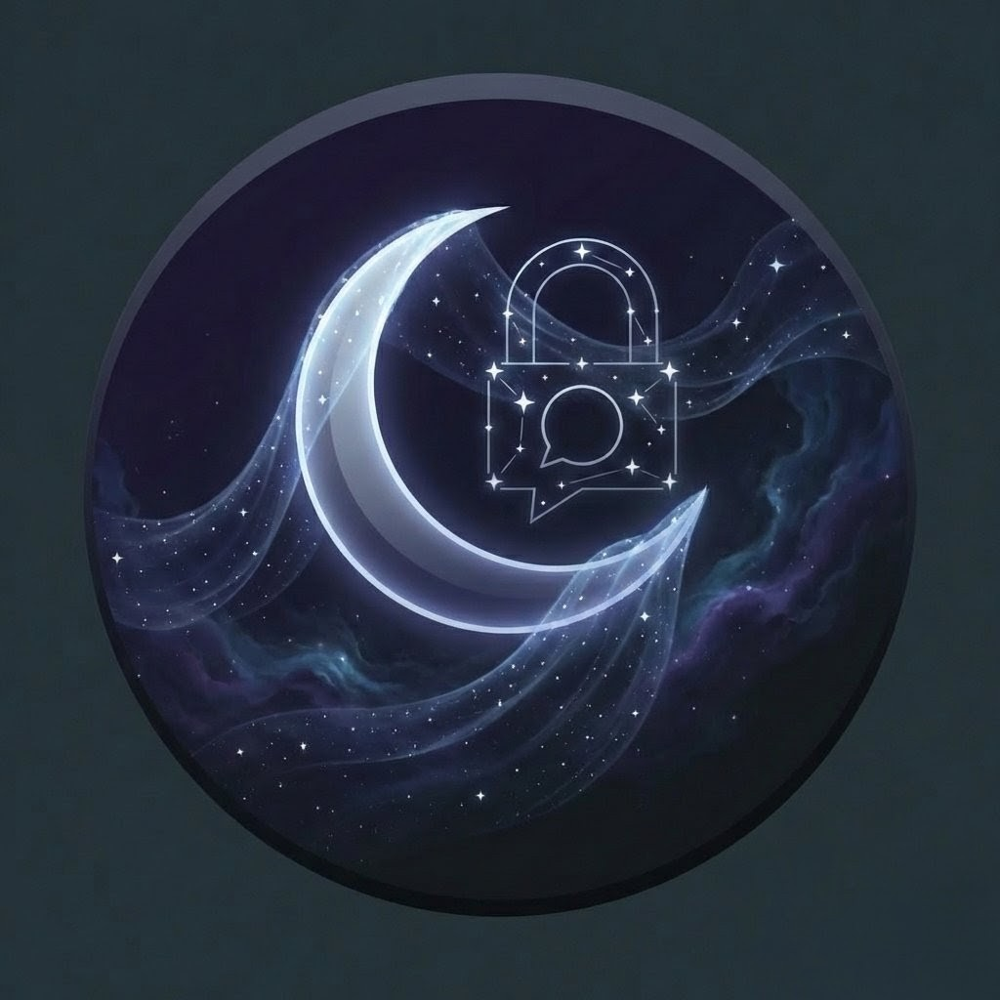
  </a>
</p>

<h1 align="center">NyxChat</h1>

<p align="center">
  <strong>Decentralized · Encrypted · Serverless · Mesh-Networked</strong>
  <br />
  <i>Secure P2P communication, even without internet access.</i>
</p>

<p align="center">
  
  
  
  
  
  
  
  <a href="https://youtu.be/6vNHgwwNARE">
    
  </a>
</p>

---

<p align="center">
  NyxChat is a privacy-first peer-to-peer messaging application. By leveraging <b>BLE mesh networking</b> and <b>end-to-end encryption</b>, it eliminates the need for central servers, ensuring your data stays yours—even in off-grid environments.
</p>

---

## Table of Contents

- [Overview](#overview)
- [Demo Video](#demo-video)
- [Key Features](#key-features)
- [System Architecture](#system-architecture)
- [Networking Layer](#networking-layer)
  - [Peer Discovery (mDNS)](#peer-discovery-mdns)
  - [BLE Mesh Networking](#ble-mesh-networking)
  - [DHT Global Discovery](#dht-global-discovery)
  - [Internet Relay (Optional)](#internet-relay-optional)
- [Cryptographic Layer](#cryptographic-layer)
  - [Key Management](#key-management)
  - [Encryption Engine](#encryption-engine)
  - [Forward Secrecy](#forward-secrecy)
  - [Post-Quantum Hybrid Key Exchange](#post-quantum-hybrid-key-exchange)
- [Mesh Routing Protocol](#mesh-routing-protocol)
  - [Spray-and-Wait Algorithm](#spray-and-wait-algorithm)
  - [Mesh Packet Structure](#mesh-packet-structure)
  - [Store-and-Forward](#store-and-forward)
- [Geohash Channels](#geohash-channels)
- [Privacy & Security](#privacy--security)
  - [App Lock & Data Security](#app-lock--data-security)
- [Wire Protocol](#wire-protocol)
- [Data Models](#data-models)
- [Project Structure](#project-structure)
- [Tech Stack](#tech-stack)
- [Getting Started](#getting-started)
- [License](#license)

---

## Overview

**NyxChat** is a fully decentralized, peer-to-peer encrypted messaging application built with Flutter. Unlike conventional messengers (WhatsApp, Signal, Telegram) that rely on central servers for message relay and user registration, NyxChat operates with **zero server infrastructure**.

Messages are delivered directly between devices via:

1. **Wi-Fi/LAN** — automatic peer discovery on the same network using mDNS
2. **Bluetooth Low Energy (BLE)** — infrastructure-free mesh networking for offline environments
3. **DHT** — global peer discovery across networks
4. **Optional Internet Relay** — encrypted bridge between disconnected networks

Every message is protected with **end-to-end encryption (E2EE)** using modern cryptographic primitives (X25519 + Kyber-768 hybrid key exchange + AES-256-GCM), and the system is designed so that even mesh relay nodes and optional internet relays **cannot read message content** or **identify participants**.

---

## Key Features

| Category | Feature | Description |
|----------|---------|-------------|
| **Encryption** | E2EE (AES-256-GCM) | All messages encrypted end-to-end |
| **Key Exchange** | X25519 + Kyber-768 Hybrid | Classical ECDH + post-quantum ML-KEM for quantum-resistant sessions |
| **Forward Secrecy** | Double Ratchet | Per-message key rotation for Perfect Forward Secrecy |
| **App Lock** | PBKDF2 + AES-GCM | Zero-knowledge password-based database encryption |
| **Security** | Duress PIN / Stealth | Decoy mode under coercion; reduced network footprint |
| **Resilience** | Self-Healing Storage | Auto-recovers from corrupted/reset Hive databases |
| **Resilience** | Identity Auto-Recovery | Reconstructs identity from crypto keys if DB is reset; no re-onboard |
| **Background** | Foreground Service | Persistent mesh & DHT via Android foreground service |
| **Wi-Fi Direct** | Nearby Connections | High-bandwidth offline file transfers |
| **Networking** | Multi-Transport | Wi-Fi Direct, mDNS, BLE Mesh (Coded PHY Long Range), DHT, Tor Relay |
| **Discovery** | mDNS/DNS-SD | Zero-config local peer discovery via Bonsoir |
| **Offline Mesh** | BLE GATT + MANET | Communicate without Wi-Fi using dynamic distance-vector routing |
| **Geo Channels** | Geohash-based | Anonymous location-aware group messaging |
| **Performance** | Dart Isolates | Background threading for 120fps UI under heavy mesh load |
| **Chat** | Full-featured | Text, files, images, reactions, replies, groups |
| **Privacy** | Dummy Traffic | Makes real traffic indistinguishable from noise |
| **Privacy** | Disappearing Messages | Auto-delete after configurable duration |
| **Privacy** | Panic Wipe | Instant, irreversible destruction of all data |
| **Privacy** | Stealth Mode | Reduced network footprint |
| **Privacy** | Anti-Timing | Random delays to prevent traffic analysis |
| **Storage** | Local-Only | Hive DB + Flutter Secure Storage; no cloud |

---

## Architecture Highlights

NyxChat's architecture is built on several pillars:

1. **Performance Core:** All heavy cryptographic hashing and mesh routing runs on **Dart Isolates** for buttery smooth 120fps performance, paired with **Adaptive Sensor Scanning** (accelerometer-driven BLE throttling) to minimize battery drain when stationary.
2. **Advanced Mesh:** Full **MANET (Distance-Vector)** routing protocol with smart route discovery and **Wi-Fi Direct** (Google Nearby Connections) for megabyte-per-second off-grid file transfers.
3. **Double Ratchet:** Complete **Signal Double Ratchet** implementation (`SessionKeyManager`) with DH ratchet steps on every incoming ephemeral key change and symmetric KDF chain ratcheting on every message, providing per-message Perfect Forward Secrecy.
4. **App Lock:** Zero-knowledge password-based encryption — databases are encrypted with a master key wrapped by a PBKDF2-derived key (100k iterations). Includes panic wipe after 5 failed attempts.
5. **Self-Healing Storage:** Encrypted Hive databases automatically recover from key mismatches — corrupted box files are deleted and recreated, while cryptographic identity is deterministically reconstructed from keys stored in the platform's TEE/Secure Enclave.
6. **Identity Auto-Recovery:** Crypto keys (X25519 + Ed25519 + Kyber-768) and display name are persisted in `FlutterSecureStorage` independently of Hive. If the encrypted database is ever reset (corruption, key mismatch, OS restore), identity is automatically reconstructed — users never have to re-onboard.
7. **Post-Quantum Cryptography:** Hybrid ML-KEM (Kyber-768) + X25519 key exchange defends against "Harvest Now, Decrypt Later" quantum attacks. The Kyber shared secret is combined with the classical ECDH secret via HKDF to form a hybrid root key — sessions remain secure even if one primitive is broken.
8. **BLE Coded PHY (Long Range):** Optional Bluetooth 5.0 Coded PHY (S=8) support extends BLE mesh range up to 4× compared to standard 1M PHY. Graceful fallback on unsupported hardware.
9. **Stealth & Duress:** Duress PIN support for decoy mode under coercion, and stealth mode for reduced network footprint.
10. **Background Service:** Android foreground service keeps mesh networking and DHT alive in the background. DHT active state is persisted in secure storage and auto-restored on app restart.
11. **Domain Fronting + Tor:** Relay client supports domain fronting (masquerades as `ajax.googleapis.com`) and optional Tor routing via Orbot.

---

## System Architecture

The application follows a **layered architecture** with clear separation of concerns:

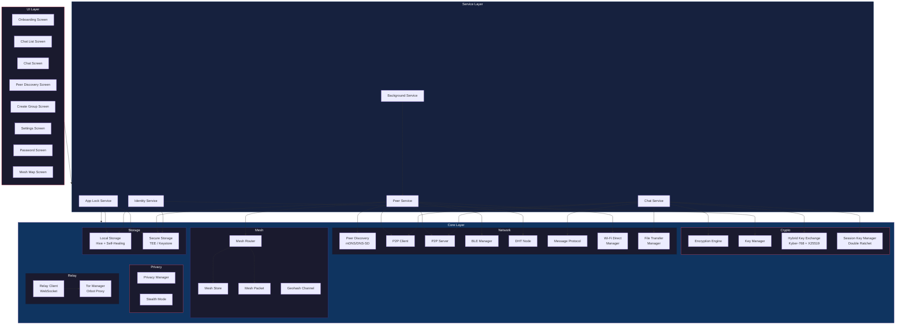
```mermaid
graph TB
    subgraph UI["UI Layer"]
        OS[Onboarding Screen]
        CLS[Chat List Screen]
        CS[Chat Screen]
        PDS[Peer Discovery Screen]
        CGS[Create Group Screen]
        SS[Settings Screen]
        PWS[Password Screen]
        MMS[Mesh Map Screen]
    end

    subgraph Services["Service Layer"]
        IS[Identity Service]
        ChatSvc[Chat Service]
        PS[Peer Service]
        ALS[App Lock Service]
        BGS[Background Service]
    end

    subgraph Core["Core Layer"]
        subgraph Crypto["Crypto"]
            EE[Encryption Engine]
            KM[Key Manager]
            HKE[Hybrid Key Exchange<br/>Kyber-768 + X25519]
            SKM[Session Key Manager<br/>Double Ratchet]
        end

        subgraph Network["Network"]
            PD[Peer Discovery<br/>mDNS/DNS-SD]
            P2PC[P2P Client]
            P2PS[P2P Server]
            BLE[BLE Manager]
            DHT[DHT Node]
            MP[Message Protocol]
            WDM[Wi-Fi Direct<br/>Manager]
            FTM[File Transfer<br/>Manager]
        end

        subgraph Mesh["Mesh"]
            MR[Mesh Router]
            MS[Mesh Store]
            MPkt[Mesh Packet]
            GC[Geohash Channel]
        end

        subgraph Privacy["Privacy"]
            PM[Privacy Manager]
            SM[Stealth Mode]
        end

        subgraph Relay["Relay"]
            RC[Relay Client<br/>WebSocket]
            TM[Tor Manager<br/>Orbot Proxy]
        end

        subgraph Storage["Storage"]
            LS[Local Storage<br/>Hive + Self-Healing]
            SS2[Secure Storage<br/>TEE / Keystore]
        end
    end

    UI --> Services
    Services --> Core
    IS --> KM
    IS --> LS
    IS --> SS2
    ChatSvc --> EE
    ChatSvc --> SKM
    ChatSvc --> HKE
    ChatSvc --> P2PC
    ChatSvc --> P2PS
    ChatSvc --> MP
    ChatSvc --> FTM
    PS --> PD
    PS --> P2PC
    PS --> P2PS
    PS --> BLE
    PS --> DHT
    PS --> MR
    PS --> WDM
    PS --> SS2
    ALS --> LS
    ALS --> SS2
    BGS --> PS
    MR --> MS
    MR --> MPkt
    RC --> TM

    style UI fill:#1a1a2e,stroke:#e94560,color:#fff
    style Services fill:#16213e,stroke:#0f3460,color:#fff
    style Core fill:#0f3460,stroke:#533483,color:#fff
    style Crypto fill:#1a1a2e,stroke:#e94560,color:#fff
    style Network fill:#1a1a2e,stroke:#0f3460,color:#fff
    style Mesh fill:#1a1a2e,stroke:#533483,color:#fff
    style Privacy fill:#1a1a2e,stroke:#e94560,color:#fff
    style Relay fill:#1a1a2e,stroke:#0f3460,color:#fff
    style Storage fill:#1a1a2e,stroke:#533483,color:#fff
```

### Data Flow Overview

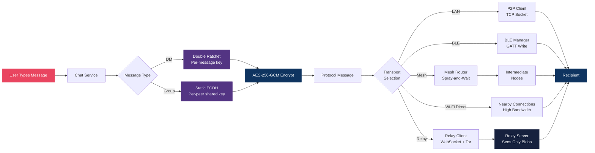
```mermaid
flowchart LR
    A[User Types Message] --> B[Chat Service]
    B --> C{Message Type}
    C -->|DM| D["Double Ratchet<br/>Per-message key"]
    C -->|Group| E["Static ECDH<br/>Per-peer shared key"]
    D --> F[AES-256-GCM Encrypt]
    E --> F
    F --> G[Protocol Message]
    G --> H{Transport<br/>Selection}
    H -->|LAN| I[P2P Client<br/>TCP Socket]
    H -->|BLE| J[BLE Manager<br/>GATT Write]
    H -->|Mesh| K[Mesh Router<br/>Spray-and-Wait]
    H -->|Wi-Fi Direct| L[Nearby Connections<br/>High Bandwidth]
    H -->|Relay| M[Relay Client<br/>WebSocket + Tor]
    I --> N[Recipient]
    J --> N
    K --> O[Intermediate<br/>Nodes] --> N
    L --> N
    M --> P[Relay Server<br/>Sees Only Blobs] --> N

    style A fill:#e94560,stroke:#e94560,color:#fff
    style D fill:#533483,stroke:#533483,color:#fff
    style E fill:#533483,stroke:#533483,color:#fff
    style F fill:#0f3460,stroke:#0f3460,color:#fff
    style N fill:#0f3460,stroke:#0f3460,color:#fff
    style P fill:#16213e,stroke:#16213e,color:#fff
```

---

## Networking Layer

NyxChat supports **five transport mechanisms**, each serving different connectivity scenarios.

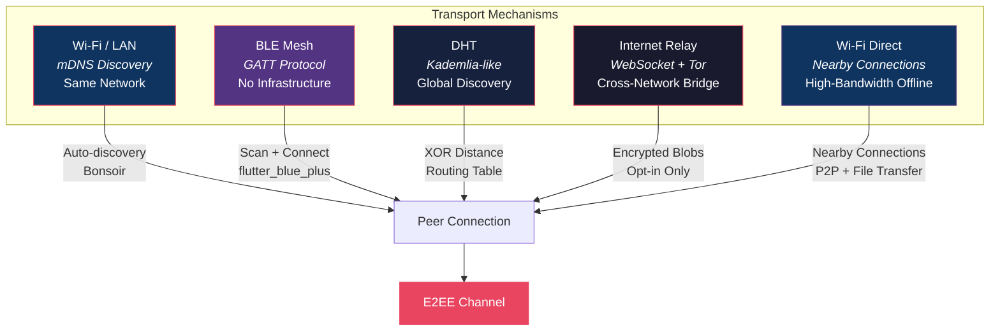
```mermaid
graph TD
    subgraph Transport["Transport Mechanisms"]
        A["Wi-Fi / LAN<br/><i>mDNS Discovery</i><br/>Same Network"]
        B["BLE Mesh<br/><i>GATT Protocol</i><br/>No Infrastructure"]
        C["DHT<br/><i>Kademlia-like</i><br/>Global Discovery"]
        D["Internet Relay<br/><i>WebSocket + Tor</i><br/>Cross-Network Bridge"]
        W["Wi-Fi Direct<br/><i>Nearby Connections</i><br/>High-Bandwidth Offline"]
    end

    A -->|"Auto-discovery<br/>Bonsoir"| E[Peer Connection]
    B -->|"Scan + Connect<br/>flutter_blue_plus"| E
    C -->|"XOR Distance<br/>Routing Table"| E
    D -->|"Encrypted Blobs<br/>Opt-in Only"| E
    W -->|"Nearby Connections<br/>P2P + File Transfer"| E

    E --> F["E2EE Channel"]

    style A fill:#0f3460,stroke:#e94560,color:#fff
    style B fill:#533483,stroke:#e94560,color:#fff
    style C fill:#16213e,stroke:#e94560,color:#fff
    style D fill:#1a1a2e,stroke:#e94560,color:#fff
    style W fill:#0f3460,stroke:#533483,color:#fff
    style F fill:#e94560,stroke:#e94560,color:#fff
```

### Peer Discovery (mDNS)

NyxChat uses **mDNS/DNS-SD** via the Bonsoir library for zero-configuration local network discovery.

**How it works:**

1. On startup, the app **broadcasts** a service of type `_nyxchat._tcp` on port `42420`
2. The broadcast includes the user's `nyxChatId`, `displayName`, and `protocolVersion` as TXT attributes
3. Simultaneously, it **discovers** other NyxChat nodes broadcasting the same service type
4. When a peer is resolved, a TCP connection is established for direct P2P messaging

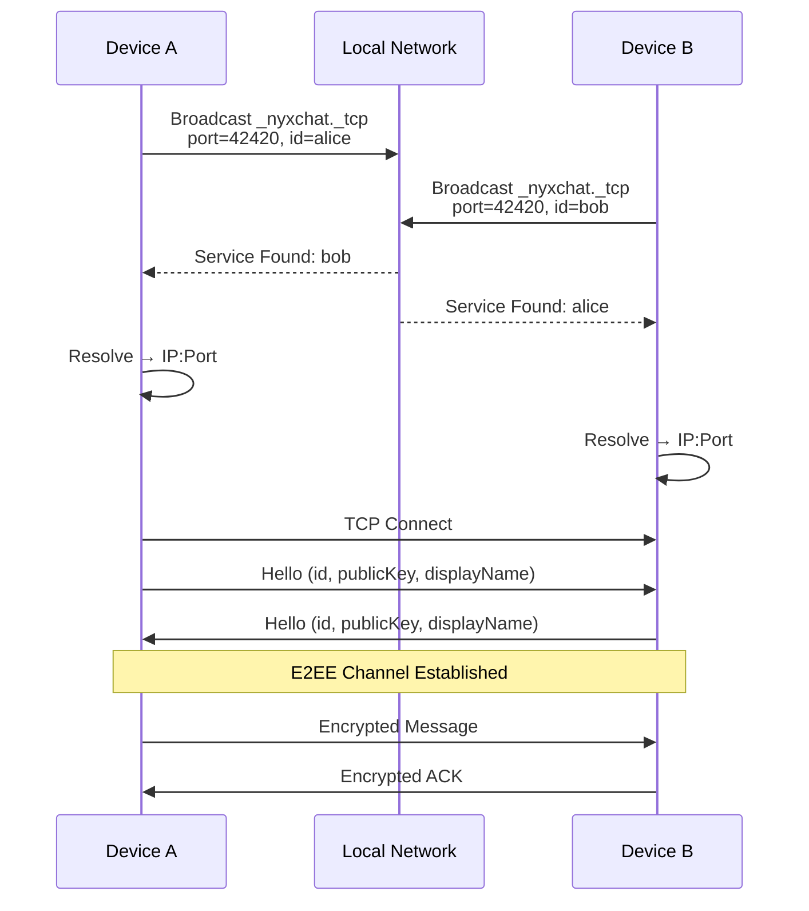
```mermaid
sequenceDiagram
    participant A as Device A
    participant Network as Local Network
    participant B as Device B

    A->>Network: Broadcast _nyxchat._tcp<br/>port=42420, id=alice
    B->>Network: Broadcast _nyxchat._tcp<br/>port=42420, id=bob

    Network-->>A: Service Found: bob
    Network-->>B: Service Found: alice

    A->>A: Resolve → IP:Port
    B->>B: Resolve → IP:Port

    A->>B: TCP Connect
    A->>B: Hello (id, publicKey, displayName)
    B->>A: Hello (id, publicKey, displayName)

    Note over A,B: E2EE Channel Established
    A->>B: Encrypted Message
    B->>A: Encrypted ACK
```

### BLE Mesh Networking

The BLE subsystem provides **infrastructure-free** communication using Bluetooth Low Energy's GATT protocol.

**Architecture:**

| Component | Role |
|-----------|------|
| `BleManager` | Scanning, advertising, connection management |
| `BleProtocol` | GATT service/characteristic definitions, chunking |
| `BlePeer` | Peer state tracking (RSSI, connection status, NyxChat ID) |

**BLE Flow:**

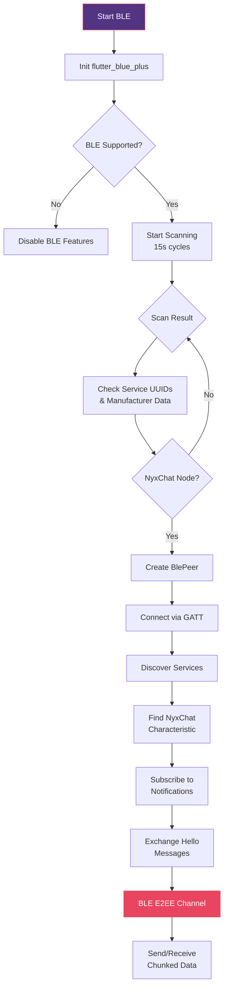
```mermaid
flowchart TD
    A[Start BLE] --> B[Init flutter_blue_plus]
    B --> C{BLE Supported?}
    C -->|No| D[Disable BLE Features]
    C -->|Yes| E[Start Scanning<br/>15s cycles]
    E --> F{Scan Result}
    F --> G[Check Service UUIDs<br/>& Manufacturer Data]
    G --> H{NyxChat Node?}
    H -->|No| F
    H -->|Yes| I[Create BlePeer]
    I --> J[Connect via GATT]
    J --> K[Discover Services]
    K --> L[Find NyxChat<br/>Characteristic]
    L --> M[Subscribe to<br/>Notifications]
    M --> N[Exchange Hello<br/>Messages]
    N --> O["BLE E2EE Channel"]
    O --> P[Send/Receive<br/>Chunked Data]

    style A fill:#533483,stroke:#e94560,color:#fff
    style O fill:#e94560,stroke:#e94560,color:#fff
```

**Key Design Decisions:**

- **Cyclic Scanning** — 15-second scan windows with 5-second pauses to conserve battery
- **Data Chunking** — Messages are split into MTU-sized chunks for reliable transfer over GATT
- **Reconnection** — Automatic reconnection on disconnect with peer state preservation
- **Dual Discovery** — Both service UUID filtering and manufacturer data identification
- **Coded PHY (Long Range)** — Optional Bluetooth 5.0 Coded PHY with S=8 coding extends range up to 4× (hundreds of meters outdoors). Enabled via `BleManager.setLongRange(true)`, which negotiates `Phy.leCoded` on all new connections. Falls back gracefully on devices that don't support BLE 5.0 Coded PHY.

### DHT Global Discovery

A simplified **Kademlia-like DHT** enables peer discovery beyond the local network.

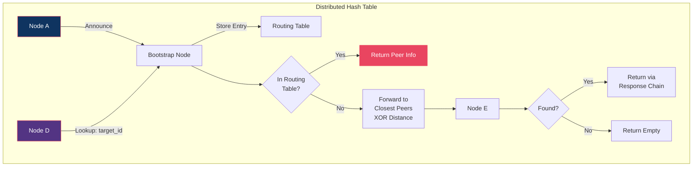
```mermaid
flowchart TD
    subgraph DHT["Distributed Hash Table"]
        A[Node A] -->|Announce| B[Bootstrap Node]
        B -->|Store Entry| C[Routing Table]
        D[Node D] -->|Lookup: target_id| B
        B --> E{In Routing<br/>Table?}
        E -->|Yes| F[Return Peer Info]
        E -->|No| G[Forward to<br/>Closest Peers<br/>XOR Distance]
        G --> H[Node E]
        H --> I{Found?}
        I -->|Yes| J[Return via<br/>Response Chain]
        I -->|No| K[Return Empty]
    end

    style A fill:#0f3460,stroke:#e94560,color:#fff
    style D fill:#533483,stroke:#e94560,color:#fff
    style F fill:#e94560,stroke:#e94560,color:#fff
```

**DHT Features:**

- **XOR-based distance metric** for efficient routing
- **Routing table** of up to 20 entries with automatic pruning of stale entries (1-hour expiry)
- **Periodic refresh** every 5 minutes
- **Bootstrap nodes** for initial network entry
- **Announcement** includes `nyxChatId`, `publicKeyHex`, `displayName`, IP address, and port

### Internet Relay (Optional)

An **opt-in** WebSocket relay bridges disconnected networks while preserving E2EE.

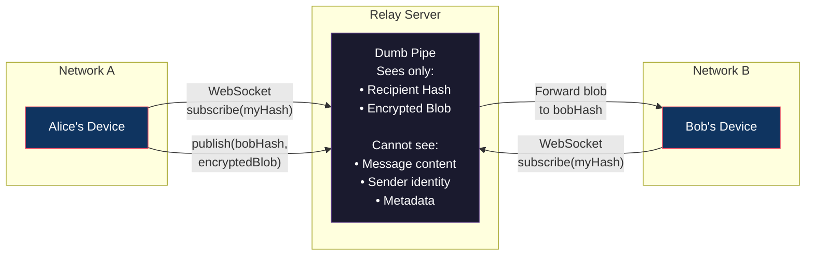
```mermaid
flowchart LR
    subgraph NetA["Network A"]
        A[Alice's Device]
    end

    subgraph Relay["Relay Server"]
        R["Dumb Pipe<br/>Sees only:<br/>• Recipient Hash<br/>• Encrypted Blob<br/><br/>Cannot see:<br/>• Message content<br/>• Sender identity<br/>• Metadata"]
    end

    subgraph NetB["Network B"]
        B[Bob's Device]
    end

    A -->|"WebSocket<br/>subscribe(myHash)"| R
    B -->|"WebSocket<br/>subscribe(myHash)"| R
    A -->|"publish(bobHash,<br/>encryptedBlob)"| R
    R -->|"Forward blob<br/>to bobHash"| B

    style A fill:#0f3460,stroke:#e94560,color:#fff
    style B fill:#0f3460,stroke:#e94560,color:#fff
    style R fill:#1a1a2e,stroke:#533483,color:#fff
```

**Relay Properties:**

- **Disabled by default** — user must explicitly opt in
- **E2EE maintained** — relay only handles opaque encrypted blobs
- **Anonymous addressing** — uses SHA-256 hashes, not plaintext IDs
- **Auto-reconnect** — 10-second reconnection interval on disconnect
- **Statistics tracking** — sent/received message counters

---

## Cryptographic Layer

### Key Management

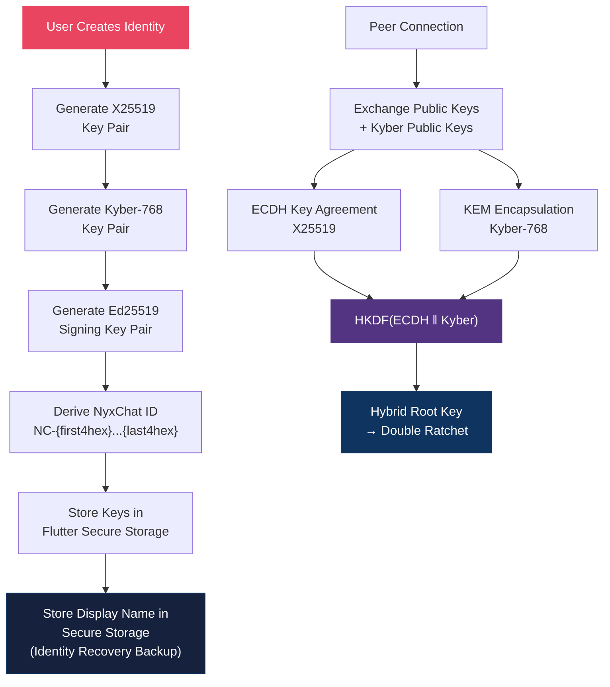
```mermaid
flowchart TD
    A[User Creates Identity] --> B[Generate X25519<br/>Key Pair]
    B --> B2[Generate Kyber-768<br/>Key Pair]
    B2 --> C[Generate Ed25519<br/>Signing Key Pair]
    C --> D["Derive NyxChat ID<br/>NC-{first4hex}...{last4hex}"]
    D --> E[Store Keys in<br/>Flutter Secure Storage]
    E --> E2["Store Display Name in<br/>Secure Storage<br/>(Identity Recovery Backup)"]

    F[Peer Connection] --> G[Exchange Public Keys<br/>+ Kyber Public Keys]
    G --> H[ECDH Key Agreement<br/>X25519]
    G --> H2[KEM Encapsulation<br/>Kyber-768]
    H --> I["HKDF(ECDH ‖ Kyber)"]
    H2 --> I
    I --> J[Hybrid Root Key<br/>→ Double Ratchet]

    style A fill:#e94560,stroke:#e94560,color:#fff
    style I fill:#533483,stroke:#533483,color:#fff
    style J fill:#0f3460,stroke:#0f3460,color:#fff
    style E2 fill:#16213e,stroke:#0f3460,color:#fff
```

| Component | Purpose |
|-----------|---------|
| `KeyManager` | Generates, stores, and loads X25519 + Ed25519 + Kyber-768 key pairs via Flutter Secure Storage |
| `EncryptionEngine` | Performs ECDH key agreement and AES-256-GCM encrypt/decrypt |
| `HybridKeyExchange` | ML-KEM (Kyber-768) + X25519 hybrid key exchange with HKDF secret combination |
| `SessionKeyManager` | Manages per-peer session keys with rotation for forward secrecy; derives hybrid root keys |

### Encryption Engine

The `EncryptionEngine` handles all cryptographic operations using industry-standard algorithms:

**Algorithms Used:**

| Operation | Algorithm | Details |
|-----------|-----------|---------|
| Key Agreement (Classical) | X25519 (ECDH) | Elliptic-curve Diffie-Hellman on Curve25519 |
| Key Agreement (Post-Quantum) | ML-KEM / Kyber-768 | Lattice-based KEM — quantum-resistant key encapsulation |
| Hybrid Key Derivation | HKDF-SHA256 | Combines ECDH + Kyber shared secrets into a single root key |
| Symmetric Encryption | AES-256-GCM | 256-bit key, authenticated encryption with associated data |
| Key Derivation | SHA-256 | For identity hashing and channel key derivation |
| Digital Signatures | Ed25519 | For message authentication |

**Encryption Flow:**

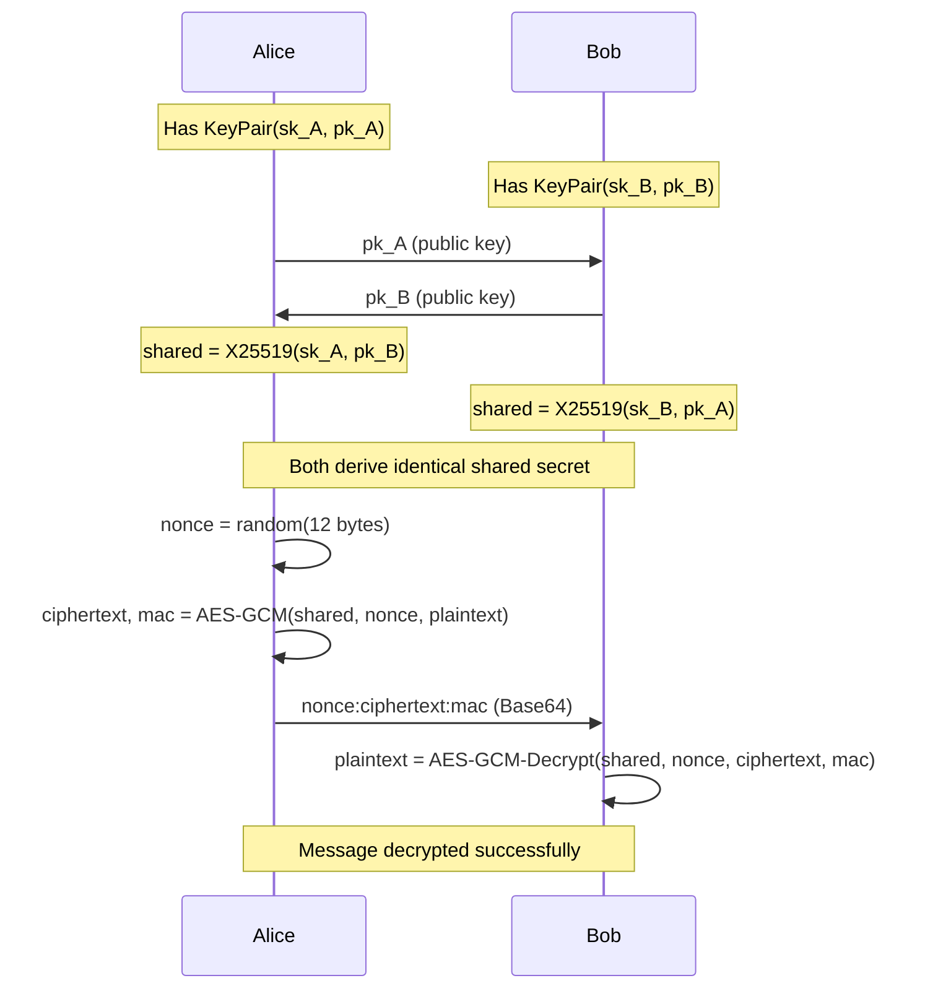
```mermaid
sequenceDiagram
    participant A as Alice
    participant B as Bob

    Note over A: Has KeyPair(sk_A, pk_A)
    Note over B: Has KeyPair(sk_B, pk_B)

    A->>B: pk_A (public key)
    B->>A: pk_B (public key)

    Note over A: shared = X25519(sk_A, pk_B)
    Note over B: shared = X25519(sk_B, pk_A)
    Note over A,B: Both derive identical shared secret

    A->>A: nonce = random(12 bytes)
    A->>A: ciphertext, mac = AES-GCM(shared, nonce, plaintext)
    A->>B: nonce:ciphertext:mac (Base64)

    B->>B: plaintext = AES-GCM-Decrypt(shared, nonce, ciphertext, mac)

    Note over A,B: Message decrypted successfully
```

**Encrypted Message Format:** `base64(nonce):base64(ciphertext):base64(mac)`

### Forward Secrecy

The `SessionKeyManager` implements the **Signal Double Ratchet** algorithm with two interlocked ratchet mechanisms:

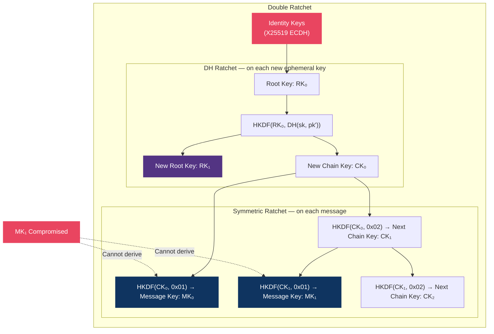
```mermaid
flowchart TD
    subgraph DR["Double Ratchet"]
        direction TB
        A["Identity Keys<br/>(X25519 ECDH)"] --> B["Root Key: RK₀"]

        subgraph DH_Ratchet["DH Ratchet — on each new ephemeral key"]
            B --> C["HKDF(RK₀, DH(sk, pk'))"]
            C --> D["New Root Key: RK₁"]
            C --> E["New Chain Key: CK₀"]
        end

        subgraph Symmetric_Ratchet["Symmetric Ratchet — on each message"]
            E --> F["HKDF(CK₀, 0x01) → Message Key: MK₀"]
            E --> G["HKDF(CK₀, 0x02) → Next Chain Key: CK₁"]
            G --> H["HKDF(CK₁, 0x01) → Message Key: MK₁"]
            G --> I["HKDF(CK₁, 0x02) → Next Chain Key: CK₂"]
        end
    end

    J["MK₁ Compromised"] -.->|"Cannot derive"| F
    J -.->|"Cannot derive"| H

    style A fill:#e94560,stroke:#e94560,color:#fff
    style D fill:#533483,stroke:#533483,color:#fff
    style F fill:#0f3460,stroke:#0f3460,color:#fff
    style H fill:#0f3460,stroke:#0f3460,color:#fff
    style J fill:#e94560,stroke:#e94560,color:#fff
```

- **DH Ratchet:** When a new ephemeral public key arrives, both parties compute fresh shared secrets and derive new root/chain keys. This provides **future secrecy** — a compromised key cannot decrypt future messages.
- **Symmetric Ratchet:** Every individual message derives a unique message key via HKDF. The chain key is then ratcheted forward. Old chain keys are destroyed — compromising a current key cannot reveal past messages (**forward secrecy**).
- **DM messages** use the full Double Ratchet; **group messages** use static ECDH per sender–recipient pair.
- Each peer pair gets an **independent ratchet session** initialized via hybrid key exchange (X25519 ECDH ‖ Kyber-768 KEM).

### Post-Quantum Hybrid Key Exchange

NyxChat defends against **"Harvest Now, Decrypt Later"** attacks by combining classical X25519 ECDH with **ML-KEM (Kyber-768)**, a NIST-standardized post-quantum key encapsulation mechanism:

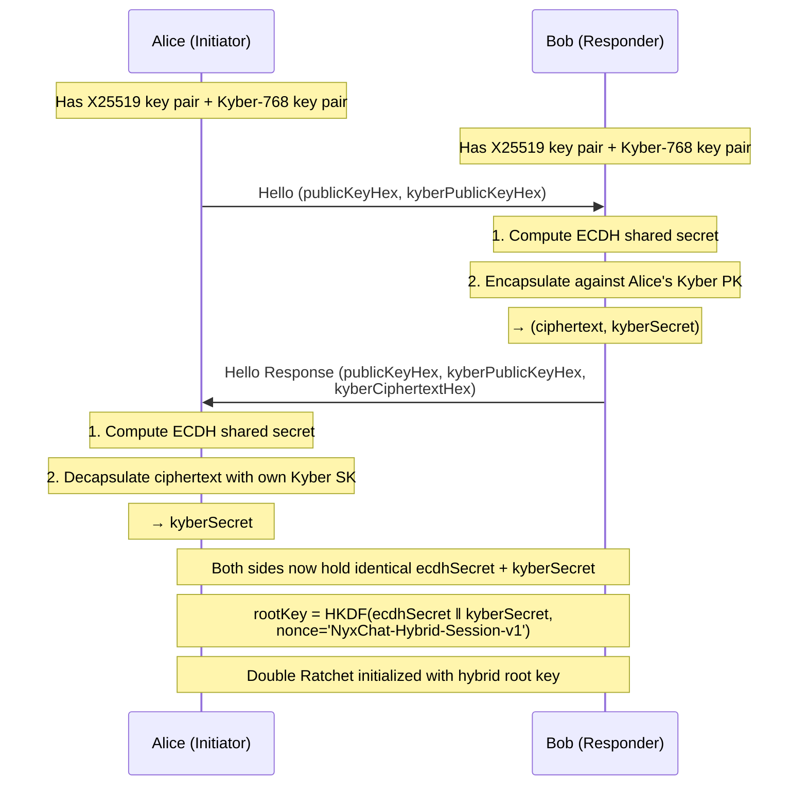
```mermaid
sequenceDiagram
    participant A as Alice (Initiator)
    participant B as Bob (Responder)

    Note over A: Has X25519 key pair + Kyber-768 key pair
    Note over B: Has X25519 key pair + Kyber-768 key pair

    A->>B: Hello (publicKeyHex, kyberPublicKeyHex)

    Note over B: 1. Compute ECDH shared secret
    Note over B: 2. Encapsulate against Alice's Kyber PK
    Note over B: → (ciphertext, kyberSecret)

    B->>A: Hello Response (publicKeyHex, kyberPublicKeyHex,<br/>kyberCiphertextHex)

    Note over A: 1. Compute ECDH shared secret
    Note over A: 2. Decapsulate ciphertext with own Kyber SK
    Note over A: → kyberSecret

    Note over A,B: Both sides now hold identical ecdhSecret + kyberSecret

    Note over A,B: rootKey = HKDF(ecdhSecret ‖ kyberSecret,<br/>nonce='NyxChat-Hybrid-Session-v1')

    Note over A,B: Double Ratchet initialized with hybrid root key
```

**Design Principles:**

| Property | Detail |
|----------|--------|
| **Hybrid Security** | If either X25519 or Kyber-768 remains secure, the session is secure |
| **No Extra Round-Trip** | Kyber ciphertext is piggybacked in the hello response |
| **Backward Compatible** | Peers without Kyber keys fall back to classical ECDH-only sessions |
| **Key Storage** | Kyber-768 key pair persisted in FlutterSecureStorage alongside X25519 |
| **Auto-Migration** | Existing installs generate Kyber keys automatically on next startup |
| **Isolate-Based** | All Kyber operations run on Dart Isolates for smooth 120fps UI |

---

## Mesh Routing Protocol

### Spray-and-Wait Algorithm

NyxChat uses the **Spray-and-Wait** delay-tolerant networking protocol for mesh message delivery:

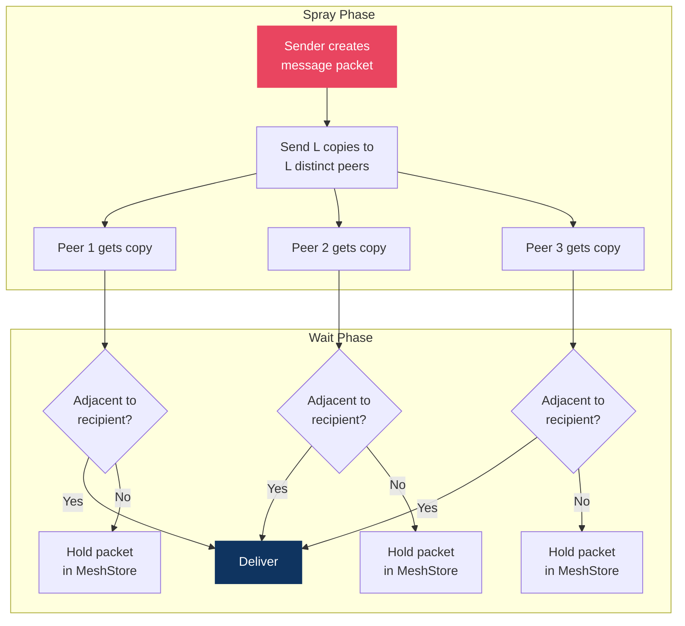
```mermaid
flowchart TD
    subgraph Spray["Spray Phase"]
        A[Sender creates<br/>message packet] --> B[Send L copies to<br/>L distinct peers]
        B --> C[Peer 1 gets copy]
        B --> D[Peer 2 gets copy]
        B --> E[Peer 3 gets copy]
    end

    subgraph Wait["Wait Phase"]
        C --> F{Adjacent to<br/>recipient?}
        D --> G{Adjacent to<br/>recipient?}
        E --> H{Adjacent to<br/>recipient?}
        F -->|Yes| I["Deliver"]
        F -->|No| J[Hold packet<br/>in MeshStore]
        G -->|Yes| I
        G -->|No| K[Hold packet<br/>in MeshStore]
        H -->|Yes| I
        H -->|No| L[Hold packet<br/>in MeshStore]
    end

    style A fill:#e94560,stroke:#e94560,color:#fff
    style I fill:#0f3460,stroke:#0f3460,color:#fff
```

**Protocol Parameters:**

| Parameter | Default | Description |
|-----------|---------|-------------|
| `defaultTtl` | 7 | Maximum hops before packet is dropped |
| `sprayCount` | 3 | Number of copies (L) in spray phase |
| Anti-timing delay | 0–2 seconds | Random delay before forwarding |
| Packet expiry | 24 hours | Maximum age before auto-deletion |
| Deduplication | Packet ID | Prevents processing the same packet twice |

### Mesh Packet Structure

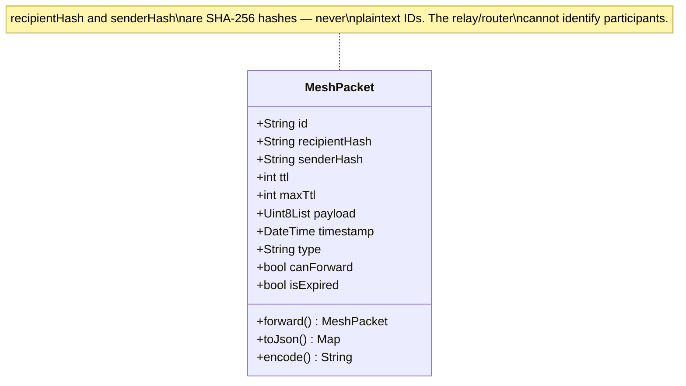
```mermaid
classDiagram
    class MeshPacket {
        +String id
        +String recipientHash
        +String senderHash
        +int ttl
        +int maxTtl
        +Uint8List payload
        +DateTime timestamp
        +String type
        +forward() MeshPacket
        +bool canForward
        +bool isExpired
        +toJson() Map
        +encode() String
    }

    note for MeshPacket "recipientHash and senderHash\nare SHA-256 hashes — never\nplaintext IDs. The relay/router\ncannot identify participants."
```

**Packet Types:** `message`, `ack`, `mesh_hello`

### Store-and-Forward

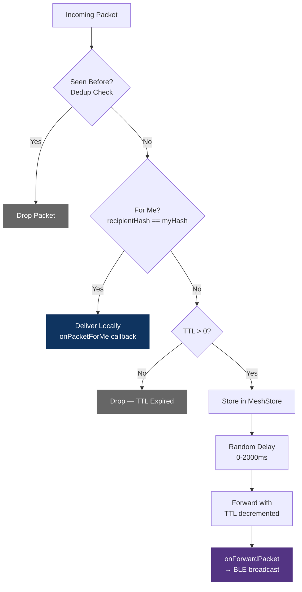
```mermaid
flowchart TD
    A[Incoming Packet] --> B{Seen Before?<br/>Dedup Check}
    B -->|Yes| C[Drop Packet]
    B -->|No| D{For Me?<br/>recipientHash == myHash}
    D -->|Yes| E["Deliver Locally<br/>onPacketForMe callback"]
    D -->|No| F{TTL > 0?}
    F -->|No| G[Drop — TTL Expired]
    F -->|Yes| H[Store in MeshStore]
    H --> I[Random Delay<br/>0-2000ms]
    I --> J[Forward with<br/>TTL decremented]
    J --> K[onForwardPacket<br/>→ BLE broadcast]

    style C fill:#666,stroke:#666,color:#fff
    style E fill:#0f3460,stroke:#0f3460,color:#fff
    style G fill:#666,stroke:#666,color:#fff
    style K fill:#533483,stroke:#533483,color:#fff
```

**MeshStore** provides:

- **Persistent queue** with maximum 100 stored packets
- **Deduplication** via seen-packet-ID tracking (last 500 IDs)
- **Statistics** — stored count, seen count, delivered count
- **Forwardable packet retrieval** — returns unexpired, undelivered packets with TTL > 0

---

## Geohash Channels

Geohash channels enable **anonymous, location-aware group messaging** without revealing user identities.

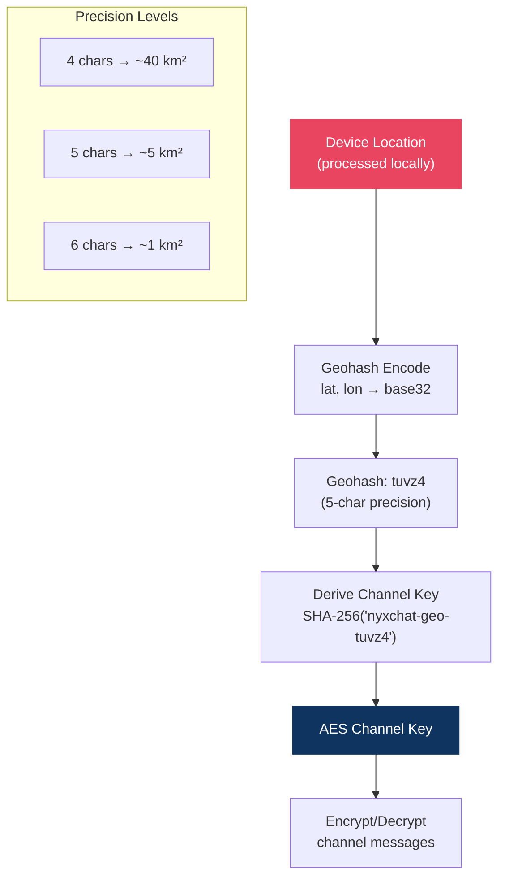
```mermaid
flowchart TD
    A["Device Location<br/>(processed locally)"] --> B["Geohash Encode<br/>lat, lon → base32"]
    B --> C["Geohash: tuvz4<br/>(5-char precision)"]
    C --> D["Derive Channel Key<br/>SHA-256('nyxchat-geo-tuvz4')"]
    D --> E["AES Channel Key"]
    E --> F["Encrypt/Decrypt<br/>channel messages"]

    subgraph Precision["Precision Levels"]
        P4["4 chars → ~40 km²"]
        P5["5 chars → ~5 km²"]
        P6["6 chars → ~1 km²"]
    end

    style A fill:#e94560,stroke:#e94560,color:#fff
    style E fill:#0f3460,stroke:#0f3460,color:#fff
```

**Key Properties:**

- Location is **never transmitted** — only processed locally to compute the geohash
- Users in the same geohash cell **share a derived channel key**
- Messages are **anonymous** — identified only by sender hash
- Keeps last **200 messages** per channel
- Precision is **configurable** (3–8 characters)

---

## Privacy & Security

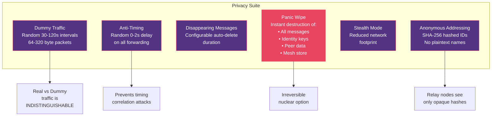
```mermaid
flowchart TD
    subgraph Privacy["Privacy Suite"]
        A["Dummy Traffic<br/>Random 30-120s intervals<br/>64-320 byte packets"]
        B["Anti-Timing<br/>Random 0-2s delay<br/>on all forwarding"]
        C["Disappearing Messages<br/>Configurable auto-delete<br/>duration"]
        D["Panic Wipe<br/>Instant destruction of:<br/>• All messages<br/>• Identity keys<br/>• Peer data<br/>• Mesh store"]
        E["Stealth Mode<br/>Reduced network<br/>footprint"]
        F["Anonymous Addressing<br/>SHA-256 hashed IDs<br/>No plaintext names"]
    end

    A --> G["Real vs Dummy<br/>traffic is<br/>INDISTINGUISHABLE"]
    B --> H["Prevents timing<br/>correlation attacks"]
    D --> I["Irreversible<br/>nuclear option"]
    F --> J["Relay nodes see<br/>only opaque hashes"]

    style A fill:#533483,stroke:#e94560,color:#fff
    style B fill:#533483,stroke:#e94560,color:#fff
    style C fill:#533483,stroke:#e94560,color:#fff
    style D fill:#e94560,stroke:#e94560,color:#fff
    style E fill:#533483,stroke:#e94560,color:#fff
    style F fill:#533483,stroke:#e94560,color:#fff
```

### Threat Model

| Threat | Mitigation |
|--------|------------|
| Message interception | AES-256-GCM end-to-end encryption |
| Key compromise | Forward secrecy via session key rotation |
| Quantum computing (HNDL) | Hybrid Kyber-768 + X25519 key exchange; session remains secure if either primitive holds |
| Traffic analysis | Dummy traffic generation + anti-timing delays |
| Metadata leakage | SHA-256 hashed addressing; no plaintext IDs on wire |
| Device seizure | Panic wipe — instant, irreversible data destruction |
| Network surveillance | BLE mesh — no internet required |
| Server compromise | No servers to compromise |
| Identity linking | Geohash channels use anonymous sender hashes |

### App Lock & Data Security

NyxChat's database encryption and identity system are designed for resilience:


```mermaid
flowchart TD
    subgraph Boot["App Boot — No Password"]
        A1["Read unwrapped_master_key<br/>from Secure Storage"] --> A2{Key exists?}
        A2 -->|No| A3["Generate 256-bit key<br/>Store in TEE"]
        A2 -->|Yes| A4["Open Hive Boxes<br/>with AES cipher"]
        A3 --> A4
        A4 --> A5{Boxes decryptable?}
        A5 -->|Yes| A6["Load Identity<br/>from Hive"]
        A5 -->|No| A7["Delete corrupted boxes<br/>Create fresh empty boxes"]
        A7 --> A8["Reconstruct Identity<br/>from Secure Storage keys"]
    end

    subgraph Boot2["App Boot — Password Enabled"]
        B1["Show Password Screen"] --> B2["PBKDF2(password, salt)<br/>100K iterations"]
        B2 --> B3["Unwrap master key<br/>AES-GCM decrypt"]
        B3 --> B4["Open Hive Boxes"]
        B4 --> B5["Load Identity"]
    end

    subgraph Wipe["Panic Wipe (5 failures)"]
        C1["Delete all Hive files"] --> C2["Delete all Secure Storage"]
        C2 --> C3["Reset to Onboarding"]
    end

    style A3 fill:#533483,stroke:#533483,color:#fff
    style A8 fill:#0f3460,stroke:#0f3460,color:#fff
    style B2 fill:#533483,stroke:#533483,color:#fff
    style C1 fill:#e94560,stroke:#e94560,color:#fff
```

| Feature | Implementation |
|---------|---------------|
| **DB Encryption** | AES-256-CBC (HiveAesCipher) with 256-bit master key |
| **Key Wrapping** | PBKDF2-SHA256 (100K iterations) + AES-256-GCM |
| **Key Storage** | Platform TEE / Keystore via FlutterSecureStorage |
| **Self-Healing** | Corrupted Hive boxes auto-deleted and recreated |
| **Identity Recovery** | Crypto keys + display name in Secure Storage → deterministic reconstruction |
| **DHT State** | Persisted in Secure Storage (survives DB resets) |
| **Panic Wipe** | Irreversible: deletes Hive files + all Secure Storage entries |

---

## Wire Protocol

All P2P communication uses a **JSON-based wire protocol**. Messages are serialized, encrypted, and sent over TCP sockets or BLE GATT.

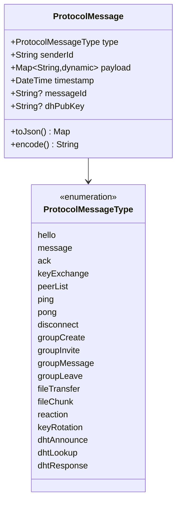
```mermaid
classDiagram
    class ProtocolMessageType {
        <<enumeration>>
        hello
        message
        ack
        keyExchange
        peerList
        ping
        pong
        disconnect
        groupCreate
        groupInvite
        groupMessage
        groupLeave
        fileTransfer
        fileChunk
        reaction
        keyRotation
        dhtAnnounce
        dhtLookup
        dhtResponse
    }

    class ProtocolMessage {
        +ProtocolMessageType type
        +String senderId
        +Map~String,dynamic~ payload
        +DateTime timestamp
        +String? messageId
        +String? dhPubKey
        +toJson() Map
        +encode() String
    }

    ProtocolMessage --> ProtocolMessageType
```

### Connection Lifecycle

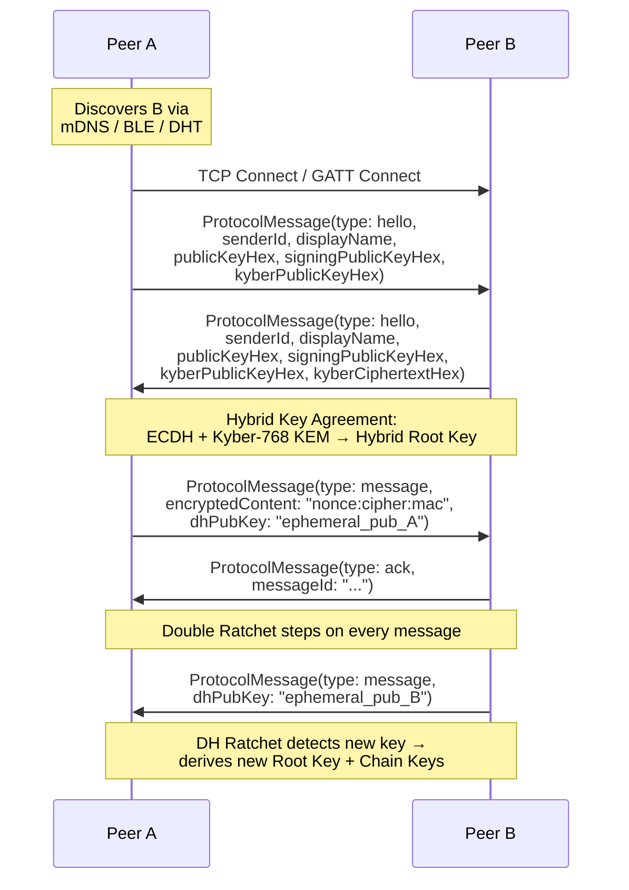
```mermaid
sequenceDiagram
    participant A as Peer A
    participant B as Peer B

    Note over A: Discovers B via<br/>mDNS / BLE / DHT

    A->>B: TCP Connect / GATT Connect
    A->>B: ProtocolMessage(type: hello,<br/>senderId, displayName,<br/>publicKeyHex, signingPublicKeyHex,<br/>kyberPublicKeyHex)

    B->>A: ProtocolMessage(type: hello,<br/>senderId, displayName,<br/>publicKeyHex, signingPublicKeyHex,<br/>kyberPublicKeyHex, kyberCiphertextHex)

    Note over A,B: Hybrid Key Agreement:<br/>ECDH + Kyber-768 KEM → Hybrid Root Key

    A->>B: ProtocolMessage(type: message,<br/>encryptedContent: "nonce:cipher:mac",<br/>dhPubKey: "ephemeral_pub_A")
    B->>A: ProtocolMessage(type: ack,<br/>messageId: "...")

    Note over A,B: Double Ratchet steps on every message
    B->>A: ProtocolMessage(type: message,<br/>dhPubKey: "ephemeral_pub_B")
    Note over A,B: DH Ratchet detects new key →<br/>derives new Root Key + Chain Keys
```

---

## Data Models

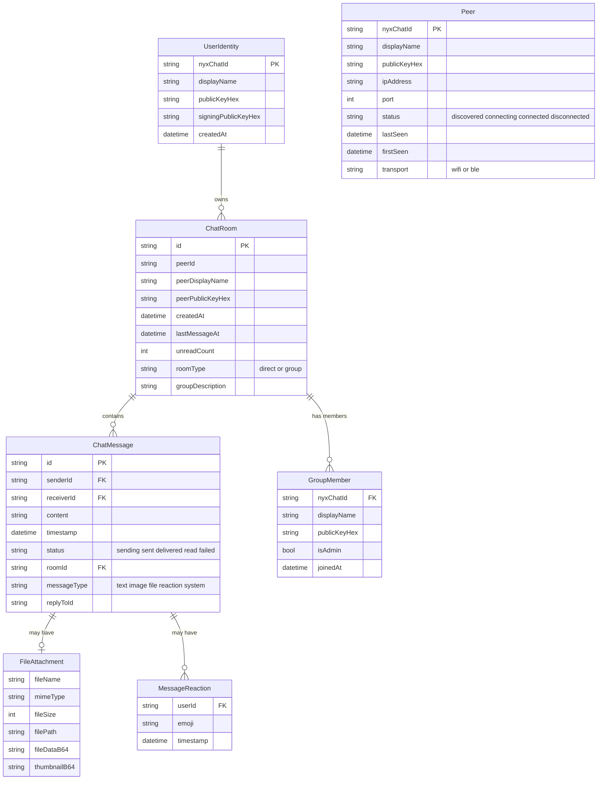
```mermaid
erDiagram
    UserIdentity {
        string nyxChatId PK
        string displayName
        string publicKeyHex
        string signingPublicKeyHex
        datetime createdAt
    }

    ChatRoom {
        string id PK
        string peerId
        string peerDisplayName
        string peerPublicKeyHex
        datetime createdAt
        datetime lastMessageAt
        int unreadCount
        string roomType "direct or group"
        string groupDescription
    }

    ChatMessage {
        string id PK
        string senderId FK
        string receiverId FK
        string content
        datetime timestamp
        string status "sending sent delivered read failed"
        string roomId FK
        string messageType "text image file reaction system"
        string replyToId
    }

    GroupMember {
        string nyxChatId FK
        string displayName
        string publicKeyHex
        bool isAdmin
        datetime joinedAt
    }

    FileAttachment {
        string fileName
        string mimeType
        int fileSize
        string filePath
        string fileDataB64
        string thumbnailB64
    }

    MessageReaction {
        string userId FK
        string emoji
        datetime timestamp
    }

    Peer {
        string nyxChatId PK
        string displayName
        string publicKeyHex
        string ipAddress
        int port
        string status "discovered connecting connected disconnected"
        datetime lastSeen
        datetime firstSeen
        string transport "wifi or ble"
    }

    UserIdentity ||--o{ ChatRoom : "owns"
    ChatRoom ||--o{ ChatMessage : "contains"
    ChatRoom ||--o{ GroupMember : "has members"
    ChatMessage ||--o| FileAttachment : "may have"
    ChatMessage ||--o{ MessageReaction : "may have"
```

---

## Project Structure

```
NyxChat/
├── lib/
│   ├── main.dart                         # App entry point, Provider setup
│   │
│   ├── core/
│   │   ├── constants.dart                # App-wide constants
│   │   │
│   │   ├── crypto/
│   │   │   ├── encryption_engine.dart    # X25519 ECDH + AES-256-GCM
│   │   │   ├── hybrid_key_exchange.dart  # ML-KEM (Kyber-768) + X25519 hybrid PQC
│   │   │   ├── key_manager.dart          # Key generation & secure storage (X25519 + Ed25519 + Kyber)
│   │   │   └── session_key_manager.dart  # Double Ratchet forward secrecy with hybrid root keys
│   │   │
│   │   ├── network/
│   │   │   ├── peer_discovery.dart       # mDNS/DNS-SD via Bonsoir
│   │   │   ├── p2p_client.dart           # Outbound TCP connections
│   │   │   ├── p2p_server.dart           # Inbound TCP listener
│   │   │   ├── ble_manager.dart          # BLE scanning, connections, GATT
│   │   │   ├── ble_protocol.dart         # BLE service/characteristic defs
│   │   │   ├── dht_node.dart             # Distributed Hash Table node
│   │   │   ├── file_transfer_manager.dart # File chunking & reassembly
│   │   │   ├── message_protocol.dart     # Wire protocol (JSON messages)
│   │   │   ├── tor_manager.dart          # Tor proxy via Orbot
│   │   │   └── wifi_direct_manager.dart  # Wi-Fi Direct (Nearby Connections)
│   │   │
│   │   ├── mesh/
│   │   │   ├── mesh_router.dart          # MANET distance-vector + Spray-and-Wait
│   │   │   ├── mesh_store.dart           # Store-and-forward queue
│   │   │   ├── mesh_packet.dart          # Mesh packet structure
│   │   │   └── geohash_channel.dart      # Location-based channels
│   │   │
│   │   ├── privacy/
│   │   │   ├── privacy_manager.dart      # Dummy traffic, panic wipe
│   │   │   └── stealth_mode.dart         # Duress PIN, decoy mode
│   │   │
│   │   ├── relay/
│   │   │   └── relay_client.dart         # Optional WebSocket relay + domain fronting
│   │   │
│   │   └── storage/
│   │       └── local_storage.dart        # Hive database operations
│   │
│   ├── models/
│   │   ├── user_identity.dart            # User identity model
│   │   ├── chat_room.dart                # Chat room + group member models
│   │   ├── message.dart                  # Message, reaction, file models
│   │   └── peer.dart                     # Peer model
│   │
│   ├── services/
│   │   ├── identity_service.dart         # Identity management
│   │   ├── chat_service.dart             # Messaging, groups, files, E2EE
│   │   ├── peer_service.dart             # Discovery, connections, DHT, BLE
│   │   ├── app_lock_service.dart         # Password-based app lock + panic wipe
│   │   └── background_service.dart       # Android foreground service
│   │
│   ├── screens/
│   │   ├── onboarding_screen.dart        # First-run identity creation
│   │   ├── chat_list_screen.dart         # Conversation list
│   │   ├── chat_screen.dart              # Chat view with messages
│   │   ├── peer_discovery_screen.dart    # Network & peer management
│   │   ├── create_group_screen.dart      # Group chat creation
│   │   ├── mesh_map_screen.dart          # Mesh network topology visualizer
│   │   ├── password_screen.dart          # App lock / unlock screen
│   │   └── settings_screen.dart          # App settings & privacy controls
│   │
│   └── theme/
│       └── app_theme.dart                # Dark theme configuration
│
├── android/                              # Android platform files
├── pubspec.yaml                          # Dependencies
└── README.md                             # This file
```

---

## Tech Stack

| Category | Technology | Purpose |
|----------|-----------|---------|
| **Framework** | Flutter / Dart ≥ 3.11.0 | Cross-platform UI |
| **BLE** | flutter_blue_plus | Bluetooth Low Energy scanning & GATT |
| **Wi-Fi Direct** | nearby_connections | High-bandwidth P2P file transfers |
| **mDNS** | Bonsoir | Zero-config network service discovery |
| **Cryptography** | cryptography (Dart) | X25519, AES-GCM, SHA-256, Ed25519, HKDF, PBKDF2 |
| **Post-Quantum** | post_quantum | ML-KEM / Kyber-768 key encapsulation for hybrid PQC key exchange |
| **Secure Storage** | flutter_secure_storage | Keychain/Keystore for private keys |
| **Local DB** | Hive + hive_flutter | High-performance NoSQL local storage |
| **State** | Provider | Reactive state management |
| **WebSocket** | web_socket_channel | Optional relay client with domain fronting |
| **Tor** | Orbot (external) | Optional onion routing via HTTP proxy |
| **Background** | flutter_background_service | Android foreground service for mesh/DHT |
| **Sensors** | sensors_plus | Accelerometer-driven adaptive BLE scanning |
| **Permissions** | permission_handler | BLE, location, storage, battery permissions |
| **UI** | shimmer, flutter_animate, animate_do | Animations and visual effects |
| **Files** | file_picker, path_provider | File selection and storage paths |
| **Utilities** | uuid, intl, convert | ID generation, date formatting, encoding |

---

## Getting Started

### Prerequisites

- **Flutter SDK** ≥ 3.32.0
- **Dart SDK** ≥ 3.11.0
- **Android Studio** or **VS Code** with Flutter extension
- **Android device/emulator** (API 21+)

### Installation

```bash
# Clone the repository
git clone https://github.com/harshitt13/NyxChat.git
cd NyxChat

# Install dependencies
flutter pub get

# Run on connected device
flutter run
```

### Build APK

```bash
# Debug build
flutter build apk --debug

# Release build
flutter build apk --release
```

### Permissions Required

| Permission | Reason |
|-----------|--------|
| `BLUETOOTH_SCAN` | Discovering nearby BLE peers |
| `BLUETOOTH_CONNECT` | Connecting to BLE peers |
| `BLUETOOTH_ADVERTISE` | Broadcasting NyxChat BLE service |
| `ACCESS_FINE_LOCATION` | BLE scanning (Android requirement) + Geohash |
| `INTERNET` | Optional relay server connectivity |
| `READ_EXTERNAL_STORAGE` | File sharing |
| `REQUEST_IGNORE_BATTERY_OPTIMIZATIONS` | Keeps DHT and mesh services running in the background |

---

## Contributing & Code of Conduct

We welcome and encourage community contributions! Please read our [Code of Conduct](CODE_OF_CONDUCT.md) to understand our community standards before participating or submitting a pull request. We strive to maintain a welcoming, inclusive, and harassment-free experience for everyone.

---

## License

This project is licensed under the **GNU General Public License v3.0** — see the [LICENSE](LICENSE) file for details.

---

<p align="center">
  <strong>NyxChat</strong> — Because privacy isn't a feature. It's a right.
</p>
