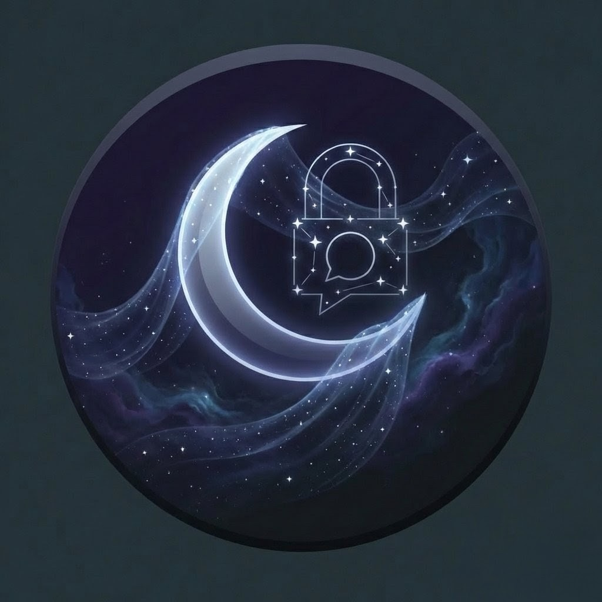
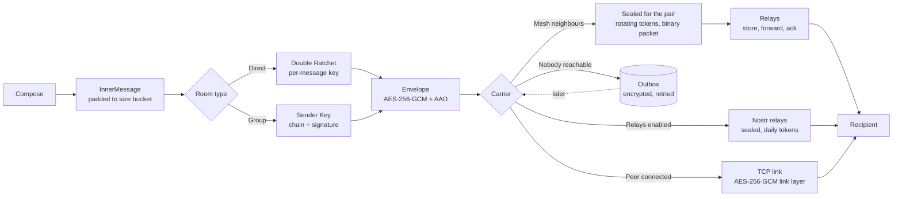

<p align="center">
  <a href="https://github.com/harshitt13/NyxChat">
    
  </a>
</p>

<h1 align="center">NyxChat</h1>

<p align="center">
  <strong>Serverless · End-to-end encrypted · Works without internet</strong>
  <br />
  <i>A peer-to-peer messenger that keeps working when the network does not.</i>
</p>

<p align="center">
  
  
  
  
  
  
  
  <a href="https://youtu.be/6vNHgwwNARE"></a>
</p>

---

NyxChat has no servers and no accounts. Your identity is a set of keys generated on your phone. Messages travel directly between devices over Wi-Fi, over a Bluetooth Low Energy mesh when there is no network at all, through public Nostr relays if you opt in, or wait in an encrypted outbox until a path appears. Every message is end-to-end encrypted with the Signal Double Ratchet on top of a hybrid X25519 + ML-KEM-768 handshake. Nearby strangers cannot even tell that you are running the app: presence beacons and mesh addresses are rotating tokens that only your contacts can recognise.

This README describes what the code does. The security properties and their limits are stated precisely in [SECURITY.md](SECURITY.md); the version history is in [CHANGELOG.md](CHANGELOG.md); Tamarin models of the handshake live in [formal/](formal/); the research paper is in [paper/](paper/).

## Contents

- [What it does](#what-it-does)
- [How a message travels](#how-a-message-travels)
- [Cryptography](#cryptography)
- [Transports](#transports)
- [Wire formats](#wire-formats)
- [Project layout](#project-layout)
- [Building and testing](#building-and-testing)
- [Status and roadmap](#status-and-roadmap)
- [License](#license)

## What it does

| Area | Feature |
|---|---|
| Messaging | Text, files and images, replies, reactions, delivery and read receipts, disappearing messages per conversation, mute, search |
| Groups | Sender-key encrypted groups, add/remove members, leave, rename; keys rotate when membership changes |
| Contacts | Trust-on-first-use key pinning, key-change alerts, 60-digit safety numbers, QR contact cards (display and camera scan), signed identity rotation |
| Offline | BLE mesh with store-and-forward, acknowledgements, files over the mesh with chunk re-requests, persistent outbox with backoff, Wi-Fi Direct forwarding |
| Internet | Optional delivery through public Nostr relays under rotating tokens, optionally via Tor (Orbot). No servers of ours. |
| Emergency | One-tap anonymous broadcast to everyone within the same geohash cell (about 5 km), with optional name and position |
| Privacy | Private discovery beacons, sealed-sender mesh addressing, link encryption hiding all metadata, length padding, stealth mode, cover traffic, screenshot blocking |
| Device security | Encrypted database, optional Argon2id password, duress password with independent decoy profile, wipe after failed attempts, panic wipe, encrypted backup and restore |
| Post-quantum | ML-KEM-768 (FIPS 203, PQClean C implementation via dart:ffi) combined with X25519 in every handshake and asynchronous session |
| Appearance | Dark, light or follow-the-system theme (status and navigation bars follow suit); the whole UI, notifications and the mesh service notification are available in English, Hindi, Spanish, French, German, Portuguese, Arabic (right-to-left layout), Chinese, Russian and Indonesian, selectable in Settings or following the device language |

## How a message travels



The same envelope is understood regardless of how it arrived. On the mesh and on internet relays it is additionally wrapped under a key only the two contacts share, so carriers see neither identities nor the ratchet header, only a rotating token and random-looking bytes.

## Cryptography

Primitives come from `package:cryptography` (X25519, Ed25519, HKDF, HMAC, AES-GCM, Argon2id) and from PQClean's ML-KEM-768 reference implementation (FIPS 203 final, C99, constant-time by construction, compiled into `libnyxpq` and bound with `dart:ffi`; verified against NIST ACVP vectors in `test/crypto/mlkem_test.dart`; not a FIPS 140-3 validated module). See `native/mlkem/README.md` for provenance and the platform RNGs used. The design follows published protocols: X3DH/PQXDH for key agreement, the Signal Double Ratchet for pairwise sessions, Sender Keys for groups.

**Identity.** X25519 identity key, Ed25519 signing key, ML-KEM-768 key. Handle = `NC-` + 64 bits of SHA-256 over both classical keys; every peer re-derives it. Rotation: a signed *key transition* statement (old and new signatures) lets contacts merge the new identity into the old conversation and inherit verification.

**Direct-link handshake.** Signed hellos with fresh ephemeral keys and nonces; master = HKDF(nonce_A || nonce_B, 0xFF*32 || dh1 || dh2 || dh3 || dh4 || kem) with dh1 = X25519(IK_A, IK_B), dh2 = X25519(EK_A, IK_B), dh3 = X25519(IK_A, EK_B), dh4 = X25519(EK_A, EK_B), kem = ML-KEM-768 encapsulation to a fresh per-handshake KEM key of the initiator (post-quantum forward secrecy). Both hellos are signed over their full transcript; the responder also signs the initiator's nonce and the hash of the initiator's whole hello, and refuses recently seen initiator nonces. Pinned keys are checked before the responder reveals anything.

**Link encryption.** After the handshake every frame is AES-256-GCM sealed under a per-direction key with a 64-bit counter nonce bound as AAD; replayed or reordered frames drop the link.

**Pairwise sessions.** Signal Double Ratchet (HKDF root chain, HMAC symmetric chains, per-message AES-256-GCM keys, header plus sender/recipient handles as AAD, 256 skipped keys per chain, commit-on-success, persisted sessions). Plaintexts are padded to a power-of-two bucket (256 B minimum) so ciphertext length reveals only the bucket.

**Pair keys.** From the static X25519 agreement between two contacts' identity keys, HKDF derives four keys used for everything that must be recognisable to the contact but opaque to everyone else: 8-byte presence tokens per 15-minute slot, 16-byte mesh addresses per hour, 32-byte relay tokens per day, and the sealed-sender wrapper key. Tokens include the recipient's handle so the two directions never collide.

**Asynchronous sessions.** X3DH-lite against pinned keys (dh1 = X25519(IK_A, IK_B), dh2 = X25519(EK_A, IK_B), kem to KPK_B); the recipient's identity key is its first ratchet key. Simultaneous initiation resolves deterministically by handle order.

**Groups.** Sender Keys: per-member chain and Ed25519 signing key distributed through pairwise ratchets; each message is padded, AES-256-GCM sealed and signed; chains rotate whenever membership shrinks.

**Files.** Random 256-bit key and 64-bit nonce prefix inside the ratchet; each 32 KiB chunk is independently sealed (nonce = prefix || index, AAD = file id, index, total) so chunks may arrive in any order over any carrier, and the receiver re-requests what is missing. SHA-256 of the plaintext is verified before the file is shown.

**Trust.** Keys pinned on first contact; a different key for the same handle is refused until accepted; safety numbers (5120 SHA-256 iterations over both fingerprints); QR/text contact cards pin and verify out of band.

**At rest.** AES-256 encrypted Hive boxes under a keystore-held master key; optional Argon2id-wrapped password (32 MiB, 2 passes); duress password opening a decoy profile with independent keys; encrypted backups (Argon2id + AES-256-GCM) of the whole profile.
## Transports

### Private discovery

Every device announces itself over mDNS (`_nyxchat._tcp`, random service name per launch) and in its BLE scan response. In private mode the announcement is a Bloom filter (128 bits over BLE, 512 bits over mDNS) of the presence tokens each pinned contact expects from you in the current 15-minute slot; strangers see bits that change every slot and carry no identity. In "visible to everyone" mode (on by default until you turn it off) the handle and name are announced so new people can find you. Contacts that recognise a beacon dial the device; the handshake then proves who it is. The smaller handle dials first; duplicate links are resolved deterministically.

### Bluetooth LE mesh

A native Android GATT server (`BlePeripheral.kt`) advertises and serves; flutter_blue_plus scans and connects. Links form in either role, exchange the handle and a per-launch random relay id, negotiate an MTU up to 512 bytes and carry binary mesh packets chunked with a two-byte header (64 KiB reassembly cap). Optional Coded PHY (long range).

### Store-and-forward

Mesh packets (binary, protocol v4) carry a random id, a rotating recipient token, a reply token, a TTL of seven hops, a timestamp with 24-hour expiry, the relay ids traversed and a payload sealed for the pair. Nodes deduplicate by id, learn a route to the reply token through the neighbour that delivered the packet, forward to the learned next hop when known and otherwise spray up to three copies (Spray-and-Wait), and offer stored packets to every new neighbour. The destination answers with an ack addressed to the reply token; every relay that sees the ack purges the packet. Emergency-channel packets are delivered to every member of the cell and still relayed. Messages to contacts with no path wait in the persistent outbox with exponential backoff. `benchmark/mesh_sim_test.dart` drives the real router through a random-waypoint mobility model.

### Internet relays (optional)

With "Deliver through public relays" enabled, envelopes that cannot go directly are sealed for the pair and published as kind-1059 Nostr events tagged with the recipient's daily token; the recipient subscribes to its tokens on the same public relays. Each event is signed with a throwaway key. Relays learn tokens and timing, never identities or content. Tor via Orbot is a switch. Files are not sent this way.

### Wi-Fi Direct and DHT

Google Nearby Connections endpoints forward mesh packets (high-bandwidth neighbour transport). A simplified Kademlia-style directory with signed, id-bound announcements can be started from the discovery screen; it lacks NAT traversal and is experimental.

## Wire formats

| Format | Where | Shape |
|---|---|---|
| `HelloMessage` | first frame of a link, plaintext | `{v:4, id, name, ik, sk, kpk, eph, nonce, port, caps, [ekpk], [pn, kct, ih], sig}` |
| Sealed frame | every later frame on a link | `{e: base64(ciphertext‖tag), c: counter}` |
| `ProtocolMessage` | inside a sealed frame | `{t: envelope\|fileChunk\|ping\|pong\|disconnect\|sessionReset\|meshPacket\|dht*, p, ts}` |
| `Envelope` | end-to-end unit | `{v:3, from, to, k: dr\|sk, h:{dh,pn,n}, [i:{eph,kct}], [ab], [it, s], c}` |
| `InnerMessage` | padded plaintext inside an envelope | `{t: text\|file\|reaction\|receipt\|skdist\|group\|open\|chunkreq, id, ts, b}` |
| Mesh packet v2 | BLE, Wi-Fi Direct, mesh-over-TCP | binary: version, type, ttl, maxTtl, ts(8), id(16), to(16), replyTo(16), n, relayIds(n×8), sealed payload |
| Discovery beacon | BLE scan response / mDNS TXT | `[4, mode, ...]`: public = handle; private = slot byte + Bloom filter |
| Nostr event | public relays | kind 1059, `["p", token]`, content = base64(sealed envelope), throwaway key |
| File chunk | sealed frame or mesh chunk packet | `{fileId, i, n, d: base64(ciphertext‖tag)}` |

Every parser enforces field types, key lengths and size limits and fails only with `FormatException`; seeded fuzz tests in `test/fuzz/` exercise them.

## Project layout

```
lib/
  core/
    crypto/      crypto_utils, nyx_id, handshake, double_ratchet, secure_channel,
                 sender_keys, session_manager, pair_keys, key_transition,
                 hybrid_key_exchange (KyberKem facade), mlkem_native (ffi), key_manager
    protocol/    envelope, inner_message, padding, parse
    network/     message_protocol, p2p_server, p2p_client, connection_manager,
                 discovery_beacon, peer_discovery (mDNS), ble_manager, ble_peripheral,
                 ble_protocol, file_transfer_manager, wifi_direct_manager, dht_node,
                 location_channel, tor_manager
    mesh/        mesh_packet (binary v2), mesh_router, mesh_store, geohash_channel
    relay/       nostr_transport, nostr_relay_adapter, relay_transport, relay_client
    storage/     local_storage (Hive), key_value_store, trust_store, outbox
    privacy/     privacy_manager (cover traffic)
  services/      identity, app_lock, settings, backup, chat (messaging engine),
                 peer (discovery + transports), background
  screens/       chat list, chat, contact verify, scan card, group info, create group,
                 discovery, emergency, settings, security, mesh diagnostics, onboarding, lock
native/mlkem/    PQClean ML-KEM-768 sources + nyxpq wrapper + CMake
android/app/src/main/kotlin/com/nyxchat/nyxchat/
                 MainActivity, BlePeripheral (GATT server), LocationChannel
formal/          Tamarin models of the handshake and asynchronous initiation
test/crypto/     ratchet, handshake, ML-KEM KATs, sender keys, sessions, pair keys,
                 beacons, mesh packets, key transition, trust store, outbox
test/fuzz/       seeded parser fuzzing
test/integration/ two- and three-node stacks over loopback TCP and simulated mesh
test/relay/      Nostr transport against an in-process mock relay
benchmark/       crypto micro-benchmarks and mesh delivery simulator
paper/           research paper (Markdown source, generated DOCX/LaTeX)
```

## Building and testing

Requirements: Flutter 3.x (Dart 3.11+), Android SDK with NDK 28 and CMake 3.22, JDK 17, a C compiler on the host for the test build of `libnyxpq` (gcc/clang on Linux and macOS; MSVC Build Tools or an x86_64 MinGW-w64 gcc on Windows, since the 32-bit MinGW.org compiler cannot produce a loadable DLL).

```bash
flutter pub get
bash tool/build_native.sh            # or: pwsh tool/build_native.ps1  (builds build/native/libnyxpq for tests)
flutter analyze
flutter test                         # unit, fuzz, relay and integration tests
flutter build apk --debug            # compiles libnyxpq.so for arm64-v8a, armeabi-v7a, x86_64
```

Release builds are signed by `.github/workflows/release.yml` when a `v*` tag is pushed and publish SHA-256 checksums alongside the APK and AAB. `ci.yml` runs analysis, the full test suite and a debug build on every push.

Benchmarks and the mesh simulation (used by the paper):

```bash
flutter test benchmark/crypto_bench_test.dart
flutter test benchmark/mesh_sim_test.dart --dart-define=SIM_SEEDS=5 --dart-define=SIM_NODES=10,20,40,80
```

## Status and roadmap

Protocol v4 is a clean break from 3.0 (mesh packet and beacon formats, KEM). The cryptographic core, session logic, parsers and the end-to-end stack are covered by automated tests, and the handshake is modelled in Tamarin, but the Bluetooth and Wi-Fi Direct paths have not yet been measured on a fleet of physical devices; treat them as beta and report what you see. iOS is not supported (no CoreBluetooth peripheral yet).

Planned: field measurements on real phones, header encryption for the ratchet, voice notes, an indexed message store for very long histories, and an external audit.

## License

GPL-3.0. See [LICENSE](LICENSE).