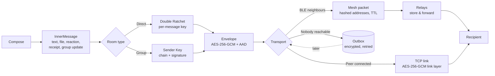
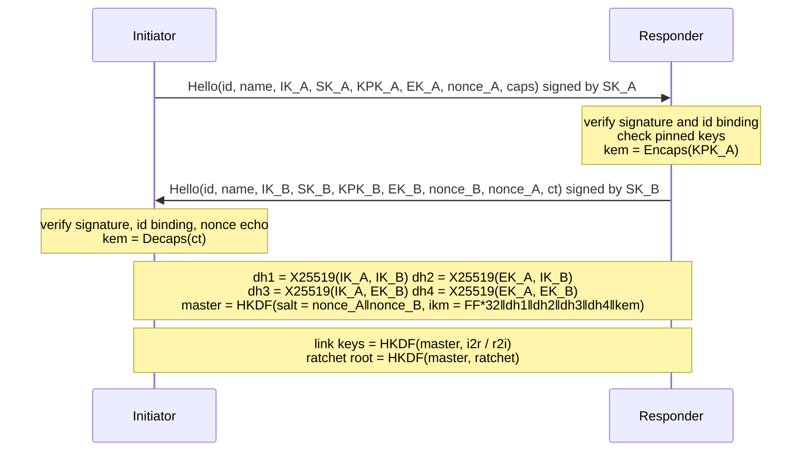

<p align="center">
  <a href="https://github.com/harshitt13/NyxChat">
    
  </a>
</p>

<h1 align="center">NyxChat</h1>

<p align="center">
  <strong>Serverless · End-to-end encrypted · Works without internet</strong>
  <br />
  <i>A peer-to-peer messenger that keeps working when the network does not.</i>
</p>

<p align="center">
  
  
  
  
  
  
  
  <a href="https://youtu.be/6vNHgwwNARE"></a>
</p>

---

NyxChat has no servers and no accounts. Your identity is a set of keys generated on your phone. Messages travel directly between devices over Wi-Fi, over a Bluetooth Low Energy mesh when there is no network at all, or wait in an encrypted outbox until a path appears. Every message is end-to-end encrypted with the Signal Double Ratchet on top of a hybrid classical + post-quantum handshake, and every direct link is additionally encrypted so that even metadata never crosses the air in the clear.

This README describes what the code does. The security properties and their limits are stated precisely in [SECURITY.md](SECURITY.md); the version history is in [CHANGELOG.md](CHANGELOG.md).

## Contents

- [What it does](#what-it-does)
- [How a message travels](#how-a-message-travels)
- [Cryptography](#cryptography)
  - [Identity](#identity)
  - [Direct-link handshake](#direct-link-handshake)
  - [Link encryption](#link-encryption)
  - [Pairwise sessions (Double Ratchet)](#pairwise-sessions-double-ratchet)
  - [Asynchronous sessions](#asynchronous-sessions)
  - [Groups (Sender Keys)](#groups-sender-keys)
  - [Files](#files)
  - [Trust: pinning, safety numbers, contact cards](#trust-pinning-safety-numbers-contact-cards)
  - [Data at rest](#data-at-rest)
- [Transports](#transports)
  - [Wi-Fi / LAN](#wi-fi--lan)
  - [Bluetooth LE mesh](#bluetooth-le-mesh)
  - [Store-and-forward](#store-and-forward)
  - [Experimental: DHT, Wi-Fi Direct, relay](#experimental-dht-wi-fi-direct-relay)
- [Wire formats](#wire-formats)
- [Project layout](#project-layout)
- [Building and testing](#building-and-testing)
- [Status and roadmap](#status-and-roadmap)
- [License](#license)

## What it does

| Area | Feature |
|---|---|
| Messaging | Text, files and images, replies, reactions, delivery and read receipts, disappearing messages per conversation, mute |
| Groups | Sender-key encrypted groups, add/remove members, leave, rename; keys rotate when membership changes |
| Contacts | Trust-on-first-use key pinning, key-change alerts, 60-digit safety numbers, QR / text contact cards |
| Offline | BLE mesh with store-and-forward, persistent outbox with backoff, delivery through intermediate devices |
| Privacy | Link encryption hides all metadata on the wire, stealth mode, cover traffic, screenshot blocking, notification content control |
| Device security | Encrypted database, optional Argon2id password, duress password with independent decoy profile, wipe after failed attempts, panic wipe |
| Post-quantum | Kyber-768 combined with X25519 in every handshake and asynchronous session |

## How a message travels



The same envelope is understood regardless of how it arrived. Relays see only hashed addresses and ciphertext; the associated data binds sender and recipient so an envelope cannot be re-addressed.

## Cryptography

All primitives come from `package:cryptography` (X25519, Ed25519, HKDF, HMAC, AES-GCM, Argon2id) and `package:post_quantum` (Kyber-768). The design follows published protocols: X3DH for key agreement, the Signal Double Ratchet for pairwise sessions and Sender Keys for groups.

### Identity

Each device generates three long-term key pairs: X25519 (key agreement), Ed25519 (signatures) and Kyber-768 (post-quantum KEM). Private keys live only in Android keystore-backed secure storage. The NyxChat ID is `NC-` followed by 64 bits of `SHA-256("NyxChat-ID-v3" || signingKey || identityKey)`; every peer re-derives it from the presented keys and refuses a handshake if it does not match.

### Direct-link handshake



The initiator becomes the Double Ratchet's "Alice" and immediately sends a session-open message so the responder can reply. Existing sessions are kept across reconnections; if either side can no longer decrypt (for example after a database reset) it sends a `sessionReset` frame and both sides re-derive from the current handshake. Two simultaneous connections between the same pair are resolved deterministically: the link dialled by the smaller ID survives.

### Link encryption

After the handshake every frame on the TCP link, including pings, receipts, reactions and file chunks, is sealed with AES-256-GCM under a per-direction key. The nonce is a 64-bit counter that is also bound as associated data, so replayed or reordered frames are rejected and the link is dropped. An observer on the same Wi-Fi sees only two signed hellos followed by opaque lines.

### Pairwise sessions (Double Ratchet)

`lib/core/crypto/double_ratchet.dart` implements the Signal specification:

- `KDF_RK` = HKDF-SHA256 with the root key as salt and the DH output as input, producing the next root key and a chain key.
- `KDF_CK` = HMAC-SHA256(chainKey, 0x01) for the message key and HMAC-SHA256(chainKey, 0x02) for the next chain key.
- The message key is expanded by HKDF into an AES-256 key and a 96-bit nonce; the header (ratchet key, previous chain length, message number) plus sender and recipient IDs are authenticated as associated data.
- Up to 256 messages can be skipped per chain and 1024 skipped keys are retained, so out-of-order delivery through the mesh works.
- All state changes are made on a working copy and committed only after the ciphertext authenticates, so a forged message can never desynchronise a session.
- Session state is serialised into the encrypted database after every step and survives restarts.

### Asynchronous sessions

To message a contact who is not currently connected, the sender runs an X3DH-style agreement against the contact's pinned keys: `dh1 = X25519(IK_A, IK_B)`, `dh2 = X25519(EK_A, IK_B)`, `kem = Kyber(KPK_B)`. The recipient's identity key doubles as its initial ratchet key and is replaced by a fresh key on the first reply. The ephemeral key and Kyber ciphertext ride along in every envelope until the recipient has answered. If both sides start a session at the same time, the one with the lexicographically smaller ID wins and the other adopts it and resends from its outbox.

### Groups (Sender Keys)

Each member owns, per group, a symmetric chain key and an Ed25519 signing key. The pair is distributed to the other members inside the pairwise Double Ratchet. A group message costs one symmetric ratchet step, one AES-256-GCM encryption and one signature regardless of group size. Receivers verify the signature, derive the message key (keeping up to 512 skipped keys for out-of-order delivery) and decrypt. Whenever someone is removed or leaves, every remaining member rotates its chain so the departed member cannot read later traffic. Membership updates and sender-key distributions travel through pairwise sessions and are accepted only from current members.

### Files

The sender hashes the file, generates a random 256-bit key and 64-bit nonce prefix, and sends a descriptor inside the ratchet. Each 32 KiB chunk is then AES-256-GCM sealed with `nonce = prefix || chunkIndex` and associated data `(fileId, index, total)`, so chunks can be verified independently, arrive out of order, and resume. The receiver writes chunks into a sparse temporary file and checks the SHA-256 before revealing it. Files need a direct link (Wi-Fi); text goes through the mesh.

### Trust: pinning, safety numbers, contact cards

The first time a peer is met, its keys are pinned. Later handshakes presenting different keys for the same ID are refused and the user is shown a "safety number changed" alert; the connection stays blocked until they accept. A safety number is a 60-digit string derived from both fingerprints (5120 iterations of SHA-256), identical on both phones if no one is in the middle. A contact card, shown as a QR code and copyable as text, carries only public keys; importing it pins and verifies the contact without ever having met over the network.

### Data at rest

All Hive boxes (messages, rooms, peers, pinned keys, ratchet sessions, sender keys, outbox, settings) are AES-256 encrypted under a random master key stored in secure storage. With the app lock enabled the master key is wrapped with AES-256-GCM under an Argon2id key (32 MiB, 2 passes, 2 lanes); installs that used PBKDF2 are re-wrapped on their next unlock. A duress password opens a separate profile with its own identity keys and, optionally, destroys the real one first. Five wrong passwords wipe everything. Corrupted boxes are deleted and recreated; identity keys are never in Hive, so a reset never forces re-onboarding.

## Transports

### Wi-Fi / LAN

Devices advertise `_nyxchat._tcp` on port 42420 via mDNS and connect to each other automatically. The smaller ID dials first; the other side waits three seconds before dialling to avoid duplicate links. Manual connection by IP address is available for networks that block multicast.

### Bluetooth LE mesh

Android has no standard way to run a GATT server from Flutter, so NyxChat ships a native peripheral (`android/app/src/main/kotlin/com/nyxchat/nyxchat/BlePeripheral.kt`). Every device both scans (flutter_blue_plus) and advertises the NyxChat service UUID with its ID in the scan response. A link is formed in either GATT role, the ID is exchanged, MTU is negotiated (up to 512) and messages are chunked with a 2-byte sequence/flags header. The same device can hold central links to some neighbours and peripheral links to others.

### Store-and-forward

Mesh packets carry an envelope, a TTL (7 hops), a timestamp (24 h expiry) and the hashed sender and recipient. Every node deduplicates by packet ID, learns routes from the recorded path and from periodic beacons, forwards to the learned next hop when it has one and otherwise sprays up to three copies (Spray-and-Wait). Packets that cannot be forwarded yet are kept in a bounded store and offered to every new neighbour. Messages to contacts with no path at all wait in the persistent outbox and are retried with exponential backoff whenever a session or link comes up. `benchmark/mesh_sim_test.dart` drives the real router through a random-waypoint mobility model to measure delivery ratio and overhead.

### Experimental: DHT, Wi-Fi Direct, relay

A simplified Kademlia-style directory can be started from the discovery screen. Announcements are Ed25519-signed and ID-bound, but there is no NAT traversal, so it only helps on routable networks. Google Nearby Connections (Wi-Fi Direct) is initialised for high-bandwidth transfers, and an internet relay client with optional Tor proxying exists in `lib/core/relay`, but neither is part of the default message path in this release.

## Wire formats

| Format | Where | Shape |
|---|---|---|
| `HelloMessage` | first frame of a link, plaintext | `{v:3, id, name, ik, sk, kpk, eph, nonce, port, caps, [pn, kct], sig}` |
| Sealed frame | every later frame on a link | `{e: base64(ciphertext‖tag), c: counter}` |
| `ProtocolMessage` | inside a sealed frame | `{t: envelope\|fileChunk\|ping\|pong\|disconnect\|sessionReset\|meshPacket\|dht*, p, ts}` |
| `Envelope` | end-to-end unit | `{v:3, from, to, k: dr\|sk, h:{dh,pn,n}, [i:{eph,kct}], [it, s], c}` |
| `InnerMessage` | plaintext inside an envelope | `{t: text\|file\|reaction\|receipt\|skdist\|group\|open, id, ts, b}` |
| `MeshPacket` | BLE and mesh-over-TCP | `{id, recipientHash, senderHash, ttl, maxTtl, payload, timestamp, type, routePath}` |
| File chunk | sealed frame | `{fileId, i, n, d: base64(ciphertext‖tag)}` |

Every parser enforces field types, key lengths and size limits (1 MiB per frame, 512 KiB per envelope, 64 KiB per mesh packet).

## Project layout

```
lib/
  core/
    crypto/      crypto_utils, nyx_id, handshake, double_ratchet, secure_channel,
                 sender_keys, session_manager, hybrid_key_exchange (Kyber), key_manager
    protocol/    envelope, inner_message
    network/     message_protocol, p2p_server (PeerConnection), p2p_client,
                 connection_manager, ble_manager, ble_peripheral, ble_protocol,
                 file_transfer_manager, peer_discovery (mDNS), dht_node,
                 wifi_direct_manager, tor_manager
    mesh/        mesh_packet, mesh_router, mesh_store, geohash_channel
    storage/     local_storage (Hive), key_value_store, trust_store, outbox
    privacy/     privacy_manager (cover traffic)
    relay/       relay_client (optional, not wired)
  services/      identity, app_lock, settings, chat (messaging engine),
                 peer (discovery + transports), background
  screens/       chat list, chat, contact verify, group info, create group,
                 discovery, settings, security, mesh diagnostics, onboarding, lock
  widgets/       message bubble
android/app/src/main/kotlin/com/nyxchat/nyxchat/
                 MainActivity (secure window toggle), BlePeripheral (GATT server)
test/crypto/     ratchet, handshake, secure channel, Kyber, sender keys,
                 session manager, trust store, outbox
benchmark/       crypto micro-benchmarks and mesh delivery simulator
paper/           research paper source (Markdown), build scripts, generated DOCX/LaTeX
```

## Building and testing

Requirements: Flutter 3.x (Dart 3.11+), Android SDK, JDK 17, an Android 8.0+ device with Bluetooth 5 for the mesh.

```bash
flutter pub get
flutter analyze
flutter test                       # ~45 unit tests, a few seconds
flutter build apk --debug          # or: flutter run
```

Release builds are signed by the GitHub Actions workflow in `.github/workflows/release.yml` when a `v*` tag is pushed. `ci.yml` runs analysis, tests and a debug build on every push.

To run the mesh simulation (writes `build/mesh_sim.csv`):

```bash
flutter test benchmark/mesh_sim_test.dart --dart-define=SIM_SEEDS=5 --dart-define=SIM_NODES=10,20,40,80
flutter test benchmark/crypto_bench_test.dart   # writes build/crypto_bench.csv
```

## Status and roadmap

Protocol v3 is a clean break from 2.x: the earlier ratchet desynchronised after its first DH step, hellos were unsigned, the Kyber call always threw and fell back to classical keys, and Bluetooth could only scan, never advertise, so two phones could not find each other. Those issues are fixed and covered by tests, but the Bluetooth path has only been exercised in the simulator and not yet on a fleet of physical devices; treat it as beta and report what you see.

Planned: iOS peripheral support, audited ML-KEM (FIPS 203) once a Dart binding exists, sealed-sender metadata protection on the mesh, a working relay with reproducible server code, voice notes.

## License

GPL-3.0. See [LICENSE](LICENSE).