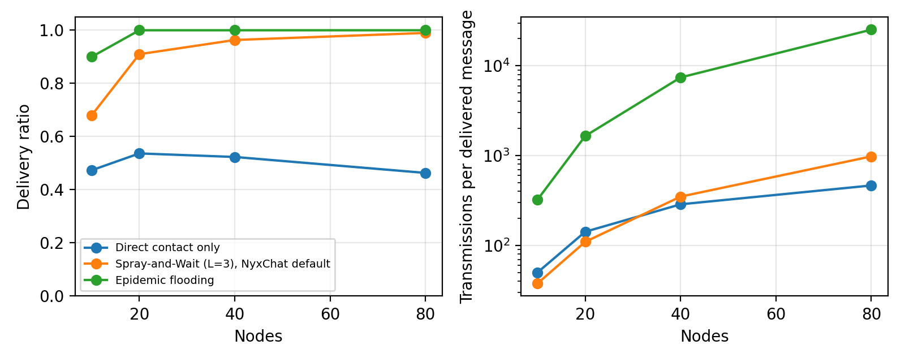

# NyxChat: A Serverless, Post-Quantum-Hybrid, Delay-Tolerant Messenger with Private Discovery and Sealed-Sender Mesh Delivery

> *Author names and affiliations to be completed by the maintainers (GitHub: harshitt13); Draft prepared September 2026*

## Abstract

Secure messengers such as Signal depend on servers for discovery, key distribution and store-and-forward delivery, and stop working when the network does. Bluetooth mesh messengers work without infrastructure but have repeatedly shipped with weak or absent authentication, no forward secrecy, and relays that can read, link or re-address traffic. We present NyxChat, an open-source Android messenger that combines both worlds. Every direct link starts with an Ed25519-signed, X3DH-style handshake that combines four X25519 values with an ML-KEM-768 (FIPS 203) encapsulation; every pairwise conversation runs the Signal Double Ratchet with padded plaintexts; groups use Sender Keys. A transport-agnostic *envelope* is delivered identically over an encrypted TCP link, over a Bluetooth Low Energy mesh, over public Nostr relays if the user opts in, or from a persistent outbox once a path appears. Two constructions make the infrastructure-free paths private: *pair keys*, derived from the static agreement between two contacts' identity keys, yield per-slot presence tokens so that discovery beacons are Bloom filters only a contact can decode, and per-epoch mesh and relay addresses plus a sealed-sender wrapper so that relays see neither identities nor ratchet headers and cannot link endpoints across epochs. Sessions to unreachable contacts are bootstrapped from pinned keys without a server, with deterministic collision resolution, and identities can be rotated through statements signed by both the old and the new key. We implemented NyxChat in 16 kLOC of Dart plus native Kotlin and C, covered it with 120 automated tests including seeded fuzzing of every parser, end-to-end tests of complete stacks, and NIST vectors for ML-KEM, wrote Tamarin models of the handshake, and evaluated cryptographic cost, wire overhead and mesh delivery: Spray-and-Wait relaying delivers 68-99% of messages across 10-80 nodes at 3-4% of the transmission cost of epidemic flooding. A case study of the application's previous release shows how documentation can promise properties that code does not provide.

## 1. Introduction

Messaging is the application people reach for first in an emergency, and it is also the one most tightly bound to infrastructure. Signal, WhatsApp and iMessage provide strong end-to-end encryption [2, 13, 18] but need a server to find peers, to exchange pre-keys and to hold messages until the recipient comes online. When cellular service is congested or cut, as during natural disasters, large demonstrations or deliberate shutdowns, those applications fail together with the network.

Infrastructure-free messengers fill that gap by relaying messages between nearby phones over Bluetooth or Wi-Fi. Their security record is poor. Bridgefy, promoted during the 2019-2020 Hong Kong protests, allowed impersonation, message decryption by relays and user tracking [6, 7]. Several newer BLE mesh applications launched with no identity authentication and added one only after public critique. Even where the cryptography is sound, discovery is not: a phone that advertises "I am Alice" to everyone in radio range is a tracking beacon, and a relay that sees "hash(Alice) sends to hash(Bob)" learns the social graph of the neighbourhood.

NyxChat is our attempt to build the messenger these situations need, treating the protocol as the product. It makes five design commitments:

- **One end-to-end unit, many carriers.** Every payload is padded, sealed into an *envelope* whose authentication binds sender and recipient, and delivered over an authenticated TCP link, the mesh, a public relay, or from an outbox. Carriers cannot read, alter or re-address it.
- **Authenticated, hybrid post-quantum key agreement.** Signed hellos, four X25519 values and an ML-KEM-768 encapsulation on every direct link; X3DH-lite against pinned keys for contacts that are unreachable.
- **Nothing recognisable to strangers.** Presence beacons, mesh addresses and relay addresses are rotating tokens derived from pair keys; envelopes on untrusted carriers are wrapped under a pair key. Strangers learn neither who is present nor who talks to whom.
- **Standard ratchets, implemented carefully.** Signal Double Ratchet with commit-on-success and persisted sessions; Sender Keys with signatures and rotation.
- **Trust the user can inspect and carry.** Keys pinned on first contact, refused on change, verifiable through safety numbers and QR contact cards; identities rotatable through doubly-signed transitions; profiles exportable as passphrase-protected backups.

The contributions of this paper are: (i) the design of a transport-agnostic secure messaging layer with private discovery and sealed-sender delivery over untrusted relays, including a deterministic resolution of concurrent session initiation; (ii) a complete open-source implementation for Android, including a native BLE GATT server and a native ML-KEM-768 binding verified against NIST vectors; (iii) a multi-level evaluation: micro-benchmarks, wire overhead, mesh simulation with the production router, seeded fuzzing of every parser, end-to-end tests of complete stacks, and Tamarin models of the handshake; and (iv) a case study of the previous release of the same application, whose ratchet, handshake, post-quantum step and Bluetooth transport were all non-functional despite documentation to the contrary.

The rest of the paper is organised as follows. Section 2 reviews the protocols and systems we build on. Section 3 states the threat model. Sections 4 and 5 present the cryptographic design and the transport layer. Section 6 describes the implementation, Section 7 the evaluation and Section 8 the security analysis. Section 9 discusses limitations and future work, and Section 10 concludes.

## 2. Background and Related Work

### 2.1 Secure messaging protocols

The Signal protocol consists of X3DH [1], an asynchronous key agreement in which an initiator combines Diffie-Hellman values between its identity and ephemeral keys and the recipient's identity and pre-keys, and the Double Ratchet [2], which derives a fresh message key for every message from a root chain advanced by Diffie-Hellman ratchet steps and symmetric chains advanced by a key derivation function. The combination provides forward secrecy and post-compromise security; its formal analysis is given by Cohn-Gordon et al. [3]. Signal's PQXDH [4] and Apple's PQ3 [18] add a post-quantum KEM (Kyber, standardised as ML-KEM in FIPS 203 [5]) to the initial agreement so that recorded traffic cannot be decrypted by a future quantum computer. Group messaging in WhatsApp and Signal uses Sender Keys [13]: each member distributes a symmetric chain and a signing key through pairwise sessions; Rösler et al. [14] analysed the resulting group security and the importance of authenticated membership changes. Unger et al. [23] survey the wider design space.

NyxChat adopts these designs rather than inventing new cryptography. What differs is the environment: there is no server to host pre-keys, so asynchronous agreement must use long-term keys the sender already holds; and there is no trusted transport, so the ratchet must tolerate out-of-order and duplicated delivery through relays.

### 2.2 Delay-tolerant networking

Delay-tolerant networking (DTN) [10] addresses networks without a contemporaneous end-to-end path. Epidemic routing [9] replicates every message to every encountered node and maximises delivery at the cost of bandwidth and storage. Spray-and-Wait [8] bounds replication: the source sprays L copies, and holders wait until they meet the destination. NyxChat's router combines Spray-and-Wait with routes learned from the paths recorded in packets, so that a node with a known next hop forwards a single copy.

### 2.3 Infrastructure-free messengers

Briar [11] routes messages over Bluetooth, Wi-Fi and Tor with its own Bramble transport protocol and pairwise handshakes; it targets contacts who have met in person and does not relay through strangers. Meshtastic [12] uses LoRa radios for long-range text with channel keys rather than per-user identities. Bridgefy [6] relayed through arbitrary phones but, as Albrecht et al. showed, its original protocol leaked social graphs, allowed message forgery and decryption by relays, and was vulnerable to a zip-bomb denial of service; Berty's Wesh [20] pursues a similar goal with IPFS-based primitives. Several BLE mesh chat applications released in 2025 initially transmitted messages without any identity binding and added authenticated handshakes only after external review. NyxChat's contribution relative to these systems is the combination of relay-through-strangers delivery with a protocol that gives relays nothing to read or forge, and with the same forward-secret ratchet used for direct links.

## 3. Threat Model

We consider an application running on two or more Android devices that may be connected over a shared Wi-Fi network, directly reachable over BLE, or connected only through a chain of intermediate NyxChat devices that are not trusted. We assume the cryptographic primitives (X25519 [17], Ed25519 [22], AES-256-GCM, HKDF [16], Argon2id [15]) are secure, and that Kyber-768 [21] may or may not be; the design must remain secure if either the classical or the post-quantum component holds.

Adversaries and their capabilities:

- **Passive observer** on the same Wi-Fi network or within Bluetooth range. Reads every byte transmitted.
- **Active network attacker** who can inject, modify, replay and drop traffic, including presenting itself as a peer during discovery.
- **Malicious relay**: a NyxChat device on the mesh path that runs modified software and may store, replay, alter or selectively drop packets, and colludes with other relays.
- **Device seizure**: physical access to a locked device, including a full disk image, with the ability to coerce the owner into entering a password.
- **Long-term key compromise** of one party at some point in time.

Security goals: confidentiality and integrity of message content and of in-conversation metadata (message ids, receipts, reactions, group membership) against all adversaries above; authentication of the peer's identity after first contact; forward secrecy and post-compromise security of conversations; unlinkability of transport-level metadata from a LAN observer beyond the fact that two devices communicate; confidentiality of data at rest under seizure, bounded by the password's entropy; and plausible deniability of the real profile under coercion.

Out of scope: malware on the endpoint, hardware side channels, denial of service by jamming, and a global adversary correlating traffic timing across the whole mesh. Mesh addressing uses stable hashes, so a relay can learn that two hashed identities communicate; we discuss this limitation in Section 8.

## 4. Cryptographic Design

### 4.1 Identity

Each device generates an X25519 identity key IK, an Ed25519 signing key SK and an ML-KEM-768 key KPK, and keeps the private halves in Android's keystore-backed secure storage. The user-visible handle is `NC-` followed by 64 bits of SHA-256 over a domain string and both classical public keys. Every peer re-derives the handle from the keys it is shown and refuses a handshake if they disagree. The handle is only a routing label; trust decisions use the full pinned keys (Section 4.10).

### 4.2 Post-quantum KEM

NyxChat uses ML-KEM-768 as standardised in FIPS 203 [5], compiled from PQClean's "clean" C99 reference implementation [24] into a small shared library and called through `dart:ffi`. The implementation is constant-time by construction; the binding adds the FIPS 203 input checks (public-key modulus check, secret-key hash check) that the reference leaves to callers, draws randomness from `getrandom(2)` on Android and verifies its return, and is tested against NIST ACVP vectors for key generation, encapsulation, decapsulation and implicit rejection. The KEM is never used alone: every secret it produces is combined with X25519 outputs through HKDF, so a flaw in either component leaves the other's security intact.

### 4.3 Direct-link handshake

When two devices connect over TCP they exchange one signed hello each. The initiator sends its identity, signing and KEM public keys, an ephemeral X25519 key EK, a fresh per-handshake ML-KEM public key, a 128-bit nonce, its listening port and capability list; the responder answers with the same fields plus the initiator's nonce, an ML-KEM ciphertext computed against the initiator's *ephemeral* KEM key, and the SHA-256 hash of the initiator's entire hello. Each hello is signed over a length-prefixed transcript of all its fields. Both sides then compute

dh1 = X25519(IK_A, IK_B), dh2 = X25519(EK_A, IK_B), dh3 = X25519(IK_A, EK_B), dh4 = X25519(EK_A, EK_B),

master = HKDF(salt = nonce_A || nonce_B, ikm = 0xFF^32 || dh1 || dh2 || dh3 || dh4 || kem, info = "NyxChat-Handshake-v3").

The structure is that of X3DH [1] with the responder's ephemeral key playing the role of a signed pre-key, extended with the KEM secret as in PQXDH [4]. dh1 authenticates both identity keys; dh2 and dh3 give forward secrecy against later compromise of either identity key; dh4 against compromise of both; the KEM secret, encapsulated to a key that lives only for this handshake, protects recorded transcripts against a future quantum adversary even if the long-term KEM key is later compromised. The responder's signature over the initiator's nonce and hello hash prevents replay of a captured response and binds the response to exactly one initiator, which rules out the identity-misbinding attack that the Tamarin model of an earlier draft exposed; the responder additionally refuses initiator nonces seen recently, and checks the initiator's keys against its pin store before revealing its own hello. There is no downgrade path. From the master secret both sides derive two link keys and a ratchet root; the initiator is the Double Ratchet's "Alice" and sends a session-open message immediately so the responder can reply.

### 4.4 Link layer

After the handshake every frame on the link is sealed with AES-256-GCM under a per-direction key derived from the master secret, using a 64-bit counter as nonce and as associated data. Replayed, reordered or dropped-and-reinjected frames terminate the link. Everything above this layer, including pings, receipts, reactions, group updates and file chunks, is hidden from a LAN observer.

### 4.5 Envelopes, inner messages and padding

An *inner message* is a small JSON document with a type (text, file descriptor, reaction, receipt, sender-key distribution, group update, session-open, chunk request, key transition), an id, a timestamp and a body. Before encryption it is padded to the next power-of-two bucket of at least 256 bytes with a length prefix, so ciphertext length reveals only the bucket. An *envelope* wraps the ciphertext with the sender and recipient handles, the kind of encryption (pairwise ratchet or group sender key), the ratchet header, and optionally a session-init block. The associated data binds a domain string, the sender handle, the recipient handle and the kind, so an envelope cannot be re-addressed.

### 4.6 Pairwise sessions

Pairwise conversations use the Double Ratchet [2] as specified: HKDF-SHA256 root KDF, HMAC-SHA256 chain KDF, per-message AES-256-GCM keys expanded by HKDF, header authenticated together with the envelope's associated data. Up to 256 messages can be skipped per chain and 1024 skipped keys are retained, which is what allows delivery through relays that reorder or duplicate. Every decrypt operates on a working copy and commits only after the tag verifies; sessions are serialised to the encrypted database after every step; a peer ratchet key that is a low-order point is rejected.

### 4.7 Asynchronous sessions and collisions

A user may write to a contact who is not connected. The sender holds the contact's pinned IK and KPK, generates an ephemeral EK and computes dh1 = X25519(IK_A, IK_B), dh2 = X25519(EK_A, IK_B) and an ML-KEM encapsulation to KPK_B; the ratchet root is HKDF over 0xFF^32 || dh1 || dh2 || kem. The recipient's identity key doubles as its initial ratchet key and is replaced at its first reply. The ephemeral key and KEM ciphertext ride in every envelope until the sender has decrypted a reply. If both contacts initiate before either message arrives, the device with the lexicographically smaller handle ignores the incoming init and the other adopts the incoming session after decrypting its first message, then resends its queued messages. Two guards keep a late copy of the abandoned initiation from displacing the session that survived: the winner remembers every init it ignored, and the loser names its abandoned ephemeral on each message (authenticated as associated data of the AEAD, so relays can neither strip nor forge it) until the winner has demonstrably heard from it, so the winner blacklists it no later than the moment it stops waiting for a reply. The Tamarin model of the collision found both orderings before release. On a direct link, an undecryptable envelope triggers a rate-limited session-reset frame and both sides re-derive from the current handshake; messages not yet acknowledged as delivered are re-queued.

### 4.8 Pair keys: presence, addressing and sealing

The novelty of the v4 protocol is that everything an untrusted party can observe on the infrastructure-free paths is a function of a secret shared only by the two contacts. From the static agreement s = X25519(IK_A, IK_B), both contacts derive with HKDF and distinct labels a discovery key, a mesh key, a relay key and a wrapping key. From these:

- the *presence token* T_disc(slot, X) = HMAC(k_disc, "disc" || slot || X)[0..8) that X shows to the other contact in a 15-minute slot;
- the *mesh address* T_mesh(epoch, R) = HMAC(k_mesh, "mesh" || epoch || R)[0..16) under which R receives in a one-hour epoch;
- the *relay address* T_relay(day, R) = HMAC(k_relay, "nostr" || day || R), a 32-byte token per day;
- the *sealed-sender wrapper* AES-256-GCM(k_wrap, nonce, envelope) with a random nonce.

Including the recipient's handle in the token input makes the two directions of a pair distinct. Tokens rotate with the slot, epoch or day, so nothing observed in one period links to another. Section 5 describes how beacons and mesh packets use them.

### 4.9 Groups, files, identity rotation, backup

Groups use Sender Keys [13]: each member owns per group a chain key and an Ed25519 signing key, distributed through pairwise ratchet envelopes; each message is padded, encrypted under the chain and signed over group id, iteration, ciphertext and associated data; up to 512 skipped keys are retained; chains rotate whenever membership shrinks, and receivers discard the departed member's chain. Files are described inside the ratchet (random key, nonce prefix, SHA-256, chunk count) and sent as independently authenticated 32 KiB chunks over whatever carrier is available; the receiver periodically requests missing chunks and verifies the hash before exposing the file. An identity is rotated by publishing a *key transition*, a statement naming the old and new handles and the new public keys, signed by both the old and the new signing key and valid for 180 days; a contact that has the old key pinned verifies both signatures and the new handle's binding, merges the conversation, session and group memberships, and inherits the verified status, so rotation raises no alarm. The whole profile (keys, pinned contacts, sessions, group keys, messages, settings) can be exported as an Argon2id- and AES-256-GCM-protected backup and restored on another device.

### 4.10 Trust management and data at rest

Keys are pinned on first contact; a later handshake presenting different keys for the same handle is refused until the user accepts after comparing 60-digit safety numbers (5120 iterations of SHA-256 over both fingerprints). Contact cards, shown as QR codes and scannable with the camera, pin and verify a contact without any network contact. Local state lives in AES-256 encrypted database boxes under a keystore-held master key; with the optional lock the master key is wrapped under an Argon2id-derived key (32 MiB, two passes); a duress password opens a second profile with independent identity keys and may destroy the real one first; five failed attempts wipe everything.

## 5. Transports and Delivery

### 5.1 Private discovery

Every device announces itself over multicast DNS (service `_nyxchat._tcp`, random instance name per launch) and in its BLE scan response. In private mode the announcement is a Bloom filter [27] of the presence tokens (Section 4.8) that each pinned contact expects from the device in the current slot: 128 bits with three positions in the 24 bytes available in a BLE scan response, 512 bits in a TXT record. A stranger sees bits that change every 15 minutes and carry no identity; a contact computes the token it expects for the current and adjacent slots, tests the filter and, on a hit, dials the device. A false positive (about 2% per stranger with ten contacts on BLE) merely causes a handshake that fails harmlessly. In public mode, which users enable to meet new people, the handle and name are announced as before. To avoid two simultaneous links, the device with the smaller handle dials first, and both sides keep the link dialled by the smaller handle if duplicates arise.

### 5.2 Bluetooth LE mesh

Standard Flutter libraries provide only the central role, which is why two instances of the previous version could never find each other. NyxChat ships a native Android GATT server that advertises the service UUID with the beacon in the scan response and exposes a write characteristic for inbound chunks and a notify characteristic for outbound ones; the beacon is rotated every slot. Links form in either role, exchange the handle and a per-launch random relay id, negotiate an MTU up to 512 bytes and carry binary frames chunked with a two-byte header, reassembled under a 64 KiB cap.

### 5.3 Sealed-sender store-and-forward

A mesh packet (binary, 61-byte header) carries a random id, a recipient token, a reply token, a TTL of seven hops, a timestamp with 24-hour expiry, the relay ids traversed and a payload sealed under the pair's wrapping key. A node deduplicates by id, learns a route to the reply token through the neighbour that delivered the packet, forwards to the learned next hop when known and otherwise sprays up to three copies among current neighbours after a random delay, and offers stored packets to every new neighbour (Spray-and-Wait [8]). Whether a packet is "for me" is decided by the application, which maintains the tokens it currently listens on for every pinned contact and for the joined emergency channel. The destination answers with an ack addressed to the reply token; every relay that sees the ack purges the packet, so the store is bounded by outstanding traffic rather than by the expiry alone. A relay therefore observes, per epoch, that token X talks to token Y, and nothing else: no identities, no ratchet headers, no message sizes finer than the padding bucket. Wi-Fi Direct endpoints and direct TCP links forward the same packets, so a LAN bridges Bluetooth neighbourhoods.

### 5.4 Internet relays

When the user enables it, an envelope that cannot go directly or over the mesh is sealed for the pair and published to public Nostr relays [25] as a kind-1059 event [26] tagged with the recipient's daily token and signed with a throwaway key; the recipient subscribes to its tokens for the current and previous day. Relays keep such events for days, so this provides worldwide store-and-forward with no infrastructure operated by the project; the connection can be routed through Tor via Orbot. Relays learn tokens, sizes and timing, never identities or content.

### 5.5 Emergency channel

A location-scoped broadcast lets people who share no contacts communicate in a crisis. The device computes its geohash cell (about 5 km at five characters) locally, derives a channel key from the cell name, and listens on a rotating channel token. Messages are AES-256-GCM sealed under the channel key and relayed by every node with TTL 10; channel packets are delivered to every member and still forwarded. The sender is anonymous unless it chooses to include a name or position.

### 5.6 Delivery state machine

Sending a message tries, in order: the authenticated TCP link, the mesh (if at least one neighbour is present and the contact's keys are pinned), the internet relay (if enabled and connected), and otherwise the persistent outbox, which stores inner messages in plaintext inside the encrypted database and re-encrypts on every attempt with exponential backoff. Receivers acknowledge text and files end to end inside the ratchet; mesh acks additionally drive the delivered state for messages that travelled through relays.

## 6. Implementation

NyxChat is written in Dart with Flutter for the user interface, Kotlin for the BLE peripheral and location access, and C for ML-KEM. Table 1 summarises the code base.

| Component | Lines |
|---|---|
| Cryptographic core and protocol formats (`core/crypto`, `core/protocol`) | 3,677 |
| Networking, mesh, relays and storage (`core/network`, `core/mesh`, `core/relay`, `core/storage`) | 5,161 |
| Services (identity, lock, settings, backup, messaging engine, discovery) | 2,737 |
| User interface | 3,234 |
| Native Android (Kotlin: GATT server, location, window security) and the ML-KEM wrapper (C) | 517 (+ vendored PQClean) |
| Tests and benchmarks (119 tests: unit, fuzz, integration, relay; simulator) | 4,128 |
Table: Size of the NyxChat code base (protocol v4).

Several engineering details are security-relevant. Every parser goes through a small hardening layer that converts type and range errors into `FormatException` and enforces field types, key lengths and size limits (1 MiB per link frame, 512 KiB per envelope, 64 KiB per mesh packet and per BLE reassembly); a socket that exceeds its buffer is closed. Frames on a link are processed strictly in order even though socket events arrive asynchronously, because link decryption is stateful. ML-KEM runs on the calling isolate through FFI (a few milliseconds), whereas Argon2id runs on a background isolate. Secret buffers are zeroed after use where the runtime allows. Continuous integration builds the native library, runs analysis and the full test suite, and builds a debug APK on every push; release builds publish SHA-256 checksums.

## 7. Evaluation

We ask four questions: what does the protocol cost on the device, how much does it add to each message on the wire, how well does the mesh deliver, and how robust is the implementation against hostile input and against integration mistakes. All numbers come from the code as shipped, produced by `flutter test benchmark/crypto_bench_test.dart`, `flutter test benchmark/mesh_sim_test.dart` and the test suite, and are reproducible from the repository.

### 7.1 Cryptographic cost

| Operation | Mean (ms) | p95 (ms) |
|---|---|---|
| X25519 key generation | 2.826 | 2.366 |
| X25519 Diffie-Hellman | 2.020 | 2.805 |
| Ed25519 sign (256 B) | 6.168 | 8.830 |
| Ed25519 verify (256 B) | 5.730 | 7.821 |
| Kyber-768 key generation | 1.290 | 18.900 |
| Kyber-768 encapsulation | 0.487 | 3.320 |
| Kyber-768 decapsulation | 0.298 | 1.915 |
| Full v3 handshake (both sides, incl. 2 signatures, 4 DH, KEM) | 43.948 | 58.530 |
| Asynchronous session initiation (X3DH-lite + KEM) | 5.373 | 6.748 |
| Double Ratchet encrypt (symmetric step, 272 B) | 1.294 | 2.979 |
| Double Ratchet decrypt (symmetric step) | 1.227 | 2.039 |
| Double Ratchet round trip with DH ratchet (2 msgs) | 15.785 | 17.991 |
| Link-layer seal (500 B frame) | 0.885 | 2.344 |
| Link-layer open (500 B frame) | 0.330 | 0.557 |
| Sender-key group encrypt + sign | 6.947 | 9.713 |
| Sender-key group verify + decrypt | 6.918 | 8.766 |
| Argon2id unlock KDF (32 MiB, 2 passes) | 414.522 | 571.101 |
| Safety number (5120 SHA-256 iterations) | 207.971 | 262.751 |
Table: Cryptographic operation latency on the host Dart VM (x86-64, single isolate). Phone figures are expected to be roughly 2-5x higher.

The native ML-KEM-768 operations cost between 0.3 and 1.5 ms, an order of magnitude less than the pure-Dart Kyber they replaced (3-12 ms), so the complete handshake, which on each side includes an Ed25519 signature and verification, four X25519 operations and a KEM operation, costs about 52 ms for both sides together on the host VM and is dominated by the pure-Dart signatures. Steady-state messaging costs a few milliseconds per message for the symmetric ratchet step (now including padding to 256 or 512 bytes) and under 30 ms for a round trip that performs two Diffie-Hellman ratchet steps. Group encryption is dominated by the Ed25519 signature. Link sealing adds about one millisecond per frame. The Argon2id parameters give an unlock of about half a second on the host and on the order of one to two seconds on a mid-range phone.

### 7.2 Wire overhead

| Object | Bytes on the wire |
|---|---|
| Inner message, 200-character text (plaintext JSON) | 272 |
| Signed hello (identity, signing and Kyber keys, ephemeral, nonce, signature) | 5216 |
| Ratchet envelope carrying the 200-character text | 554 |
| Same envelope with asynchronous session-init block (ephemeral + Kyber ciphertext) | 2094 |
| Sender-key group envelope carrying the same text | 589 |
| Link-sealed frame carrying the ratchet envelope | 804 |
Table: Wire sizes of protocol objects (JSON with base64/hex encoding, before transport framing).

A 200-character text message becomes a 272-byte inner message, padded to 512 bytes, a 554-byte envelope (the table shows the unpadded envelope; padding adds the difference to the next bucket) and an 804-byte link frame. The first messages of an asynchronous session carry an additional 1.5 KB for the ML-KEM ciphertext, and a signed hello is 5.2 KB, of which 4.7 KB are the two hex-encoded ML-KEM public keys (long-term and per-handshake). On the mesh the envelope is wrapped (28 bytes) and carried in a binary packet with a 61-byte header plus 8 bytes per relay traversed, so a padded text message occupies about 1.1 KB, or three notifications at a 512-byte BLE MTU. JSON is retained for envelopes and link frames for auditability; the mesh packet is binary because bytes matter most there.

### 7.3 Mesh delivery

The simulator instantiates one real `MeshRouter` and `MeshStore` per node and drives them with a random-waypoint mobility model in a 600 x 600 m arena with a 40 m radio range, speeds between 0.5 and 2 m/s, and one-second ticks. Sixty messages between random pairs are injected during the first ten minutes of a thirty-minute run. Three forwarding strategies are compared: *direct*, in which only the source may deliver (TTL 1); *Spray-and-Wait* with L = 3 and route learning, which is NyxChat's default; and *epidemic* flooding, which replicates to every neighbour. Each cell is the mean of five seeds.

| Strategy | Nodes | Delivery ratio | Mean latency (s) | p95 latency (s) | Transmissions per delivered msg | Mean stored packets per node |
|---|---|---|---|---|---|---|
| Direct contact only | 10 | 0.47 | 631 | 1336 | 50 | 4.9 |
| Direct contact only | 20 | 0.54 | 761 | 1394 | 142 | 2.5 |
| Direct contact only | 40 | 0.52 | 652 | 1419 | 287 | 1.2 |
| Direct contact only | 80 | 0.46 | 688 | 1412 | 465 | 0.6 |
| Spray-and-Wait (L=3), NyxChat default | 10 | 0.68 | 698 | 1333 | 38 | 18.2 |
| Spray-and-Wait (L=3), NyxChat default | 20 | 0.91 | 642 | 1184 | 110 | 24.4 |
| Spray-and-Wait (L=3), NyxChat default | 40 | 0.96 | 502 | 1129 | 350 | 30.5 |
| Spray-and-Wait (L=3), NyxChat default | 80 | 0.99 | 434 | 948 | 980 | 32.4 |
| Epidemic flooding | 10 | 0.90 | 603 | 1152 | 324 | 25.3 |
| Epidemic flooding | 20 | 1.00 | 479 | 932 | 1654 | 32.0 |
| Epidemic flooding | 40 | 1.00 | 272 | 647 | 7417 | 37.3 |
| Epidemic flooding | 80 | 1.00 | 191 | 484 | 25237 | 33.9 |
Table: Mesh delivery in a 600 x 600 m arena with 40 m radio range, random-waypoint mobility (0.5-2 m/s), 60 messages injected during the first 10 minutes of a 30-minute run; mean over 5 seeds per cell.

Direct contact delivers about half of the messages regardless of density, because delivery requires the two endpoints to meet within the run. Spray-and-Wait with route learning on reply tokens raises delivery to 68% with 10 nodes and to 99% with 80 nodes, and cuts latency as density grows, while its transmission count per delivered message stays between 4% and 5% of epidemic flooding at 40 and 80 nodes (350 versus 7,417 and 980 versus 25,237). Epidemic flooding reaches every destination at 20 nodes and above and has the lowest latency, but its cost grows super-linearly with density, which on Bluetooth translates directly into battery and channel occupancy. The bounded per-node store stays around 30 packets. The sealed-sender addressing costs nothing here: route learning on rotating reply tokens performs the same as learning on stable hashes did in the previous protocol (within one percentage point at every density). These results support Spray-and-Wait as the default and quantify what a user gives up relative to flooding: at 20 nodes, 9% of messages, which in the application are not lost but wait in the outbox for a later contact.

### 7.4 Robustness

Three further evaluations target the implementation rather than the protocol. *Fuzzing:* seeded, structure-aware fuzz tests exercise every wire parser (hello, envelope, inner message, protocol frame, file descriptor and chunk, ratchet header and state, sender-key state, secure-channel frame, pinned peer, outbox item, DHT announcement) with 500 random inputs and 1,500 mutations of a valid object each, plus 1,500 fuzzed ratchet messages, 1,500 fuzzed link frames and 5,000 random BLE chunks, asserting that only the documented exception types occur, that parsing stays under 200 ms, and that a session or channel still processes a genuine message afterwards. Writing these tests found two real defects: the BLE reassembler had no memory cap, and a hostile file descriptor whose chunk count disagreed with its size could make the receiver write far past the announced length. *Integration:* four end-to-end tests instantiate two or three complete stacks in one process over loopback TCP and a simulated mesh link and exercise handshake, session open, delivery and read receipts, reconnection, recovery after one side loses its session state, sealed mesh delivery with asynchronous initiation and acknowledgement, and a three-member group including removal and key rotation. *Formal modelling:* Tamarin [28] models of the direct-link handshake and of the asynchronous initiation with its collision rule accompany the code with lemmas for executability, secrecy of the master secret, forward secrecy under long-term key reveal, injective mutual agreement, replay resistance, secrecy under a broken DH (KEM only) and under a broken KEM (DH only), and consistency of the adopted root under concurrent initiation; they have not yet been machine-checked in the repository and are provided for review. Writing them was nevertheless productive: the modeller identified that the responder's signature did not bind the initiator's identity (allowing an identity-misbinding trace without secrecy loss), that the responder had no replay cache for initiator nonces, and that a stale initiation block from a lost collision could displace a confirmed session; all three were fixed before release, and an ephemeral KEM key was added to the handshake for post-quantum forward secrecy.

### 7.5 Case study: the previous release

Before this work the same application (version 2.0) advertised a Double Ratchet, hybrid post-quantum key exchange and a BLE mesh. Reviewing the code found the following:

- The ratchet initialised both sending and receiving chains from the root key while the receiver performed a Diffie-Hellman step on the first message the sender had not performed, so the first message after any DH step failed to decrypt; the failure was caught and the raw ciphertext was displayed as the message text. Sessions were held only in memory and re-derived from static identity keys on every launch, providing no forward secrecy against identity-key compromise.
- Hello messages were unsigned and keys were never pinned; anyone on the network could claim any handle. All metadata travelled in cleartext over TCP.
- The Kyber library expects the module rank (3) where the code passed the security level (768), so every encapsulation threw an exception that was caught and logged, and every session silently fell back to classical keys.
- The Bluetooth library used was central-only; no device ever advertised the service UUID that the scanner filtered on, so two instances could not discover each other, and no code path sent a chat message over the mesh or consumed the router's delivery callback.
- Group messages used a static Diffie-Hellman key per pair with no forward secrecy; acknowledgements were received but never processed; the relay, Tor, privacy and stealth modules were not connected to anything.

None of these defects was visible from the documentation or the user interface, which showed lock icons and "encrypted" banners throughout. We draw two conclusions. First, security claims in this class of application must be backed by tests that exercise adversarial cases (tampering, replay, reordering) and by an honest threat model, which we provide with the source. Second, the mesh transport and the protocol must be designed together: our envelope abstraction exists precisely so that the same authenticated unit is used on every path and so that a transport cannot be "wired later".

## 8. Security Analysis

We argue informally for each goal of Section 3; a machine-checked model is future work.

**Confidentiality and integrity against observers and relays.** Message content and in-conversation metadata are inside envelopes encrypted under per-message keys that both parties derive from the ratchet, whose root comes either from the handshake master secret or from the asynchronous agreement. An observer or relay holds neither. The associated data binds sender, recipient and kind, and the ratchet header is authenticated, so modification or re-addressing is detected. Duplicates and replays are rejected because a consumed message key is deleted and a skipped-key entry is removed once used.

**Peer authentication.** After first contact, a peer must present the pinned identity key and prove possession of it: the handshake signature is over a transcript that includes the fresh nonces, and the master secret includes dh1, which an impostor without the identity private key cannot compute. On true first contact the design is trust-on-first-use, the same assumption Signal makes before safety-number verification; contact cards remove even that assumption.

**Forward secrecy and post-compromise security.** Every direct-link handshake contributes ephemeral values (dh2, dh3, dh4), so recorded sessions remain confidential after an identity-key compromise. Within a session the Double Ratchet deletes chain and message keys as it advances and heals after a compromise once the honest party performs a DH ratchet step [2, 3]. Asynchronous sessions are the weaker case: until the recipient replies, confidentiality against later compromise of the recipient's identity key rests on the sender's ephemeral key alone (dh2), exactly as in X3DH without one-time pre-keys; it is restored at the first reply.

**Post-quantum confidentiality.** The KEM secret enters the master secret and the asynchronous root through HKDF alongside the classical values. A quantum adversary that breaks X25519 still needs the Kyber decapsulation key; conversely, a flaw in the Kyber implementation leaves the classical security intact. We stress that `package:post_quantum` is an unaudited implementation of the pre-standard Kyber construction; the hybrid combination is what justifies relying on it at all, and swapping in an ML-KEM binding changes one file.

**Link and presence privacy.** A LAN observer sees the two hellos, which reveal handles, display names and public keys of the two parties that chose to connect, and thereafter only sealed frames whose padded lengths and timing leak activity. In private discovery mode the beacons reveal nothing: presence tokens are HMAC outputs under a key only a contact holds, the Bloom filter is refreshed every slot, and the mDNS instance name is random; an observer cannot tell that a device runs NyxChat, let alone who it is, and cannot correlate two slots. Public mode is an explicit user choice.

**Unlinkability on the mesh and on relays.** A relay sees a recipient token and a reply token that both rotate hourly (daily on Nostr relays), per-launch random relay ids, and a payload wrapped under the pair key. It can link the two tokens of one packet and count packets within an epoch; it cannot map tokens to identities, cannot link epochs, cannot read the ratchet header, and cannot distinguish an ack from a beacon by content. Colluding relays gain only the union of these views. The wrapper is authenticated, so a relay cannot alter or re-address a packet without the drop being noticed.

**Identity rotation.** A key transition is accepted only if it carries valid signatures under both the pinned old key and the new key and the new handle is bound to the new keys, so an attacker holding neither key cannot redirect a conversation, and an attacker holding only the new keys cannot claim the old identity. An attacker holding the old key can rotate the victim's identity, which is no more than they could already do.

**Data at rest and coercion.** The database is unreadable without the master key, which is either keystore-protected or Argon2id-wrapped. The duress profile has its own keys and boxes, so the real identity and contacts are not exposed by opening it, and its optional wipe-first behaviour leaves nothing to recover. An adversary with a disk image is bounded by the password's entropy and the Argon2id cost, not by the in-app attempt counter.

**Residual risks.** Pair keys are derived from the static agreement between identity keys, so the compromise of one identity key retroactively exposes the victim's presence tokens and the outer wrapper of its past mesh and relay traffic (never the ratchet-protected content); rotating the identity closes the exposure. Bloom filters admit false positives that reveal to a stranger only that some contact of the scanner collided. Group membership is authenticated only to current members: a malicious member can add anyone. The Tamarin models have not been machine-checked in the repository and the application has not been externally audited.

## 9. Limitations and Future Work

The Bluetooth and Wi-Fi Direct transports have been exercised through the simulator and the integration tests and compile for Android, but this paper does not report measurements from a physical multi-device deployment; throughput, connection stability across Android vendors, and battery cost under continuous scanning, advertising and beacon rotation are the most important open questions and the subject of ongoing testing. Files over the mesh are capped at 4 MiB to protect relay storage. The simplified DHT lacks NAT traversal and Sybil resistance. Legacy handles from version 2 are still accepted and are derived from only 32 bits of key material; they remain safe only because trust rests on pinned keys, and they will be retired. Pair keys could be made forward-secret by deriving them from the ratchet root instead of the static agreement, at the cost of a bootstrapping problem for the first contact. Planned work includes an iOS peripheral, header encryption within the ratchet, machine-checking and extending the Tamarin models, an external audit, and a field study with volunteer users in a connectivity-constrained setting.

## 10. Conclusion

NyxChat shows that a messenger can be infrastructure-free, cryptographically conservative and private towards the strangers whose phones carry its traffic. By making an authenticated, forward-secret, padded envelope the only unit that any carrier transports, the same guarantees hold over an encrypted Wi-Fi link, through a chain of untrusted Bluetooth relays, on a public Nostr relay, and across days spent in an outbox; by deriving presence tokens, addresses and a sealed-sender wrapper from pair keys, discovery and relaying reveal nothing to anyone but the two contacts; by deriving sessions from pinned keys with a deterministic collision rule, asynchronous messaging works without a server; and by pinning keys, exposing safety numbers and signing key transitions, users can detect the attacks that have broken earlier mesh messengers without being punished for rotating their keys. The evaluation quantifies the cost of these choices, about a kilobyte per message on the mesh and tens of milliseconds per handshake with a native FIPS 203 KEM, and the delivery achievable by bounded replication, 68-99% across the densities studied at a small fraction of the cost of flooding, unaffected by the switch to rotating addresses. The case study of the previous release is a reminder that these properties exist only when the code, the tests and the documentation agree; all three, together with the fuzzers, the end-to-end tests and the formal models, are published with this paper.

## References

[1] M. Marlinspike and T. Perrin, "The X3DH Key Agreement Protocol," Signal Technical Specification, rev. 1, Nov. 2016.

[2] T. Perrin and M. Marlinspike, "The Double Ratchet Algorithm," Signal Technical Specification, rev. 1, Nov. 2016.

[3] K. Cohn-Gordon, C. Cremers, B. Dowling, L. Garratt, and D. Stebila, "A Formal Security Analysis of the Signal Messaging Protocol," Journal of Cryptology, vol. 33, pp. 1914-1983, 2020.

[4] E. Kret and R. Schmidt, "The PQXDH Key Agreement Protocol," Signal Technical Specification, rev. 3, 2023.

[5] National Institute of Standards and Technology, "Module-Lattice-Based Key-Encapsulation Mechanism Standard," FIPS 203, Aug. 2024.

[6] M. R. Albrecht, J. Blasco, R. B. Jensen, and L. Marekova, "Mesh Messaging in Large-Scale Protests: Breaking Bridgefy," in Topics in Cryptology (CT-RSA), LNCS 12704, Springer, 2021, pp. 375-398.

[7] M. R. Albrecht, R. B. Jensen, and L. Marekova, "Collective Information Security in Large-Scale Urban Protests: the Case of Hong Kong," in Proc. 30th USENIX Security Symposium, 2021, pp. 3363-3380.

[8] T. Spyropoulos, K. Psounis, and C. S. Raghavendra, "Spray and Wait: An Efficient Routing Scheme for Intermittently Connected Mobile Networks," in Proc. ACM SIGCOMM Workshop on Delay-Tolerant Networking (WDTN), 2005, pp. 252-259.

[9] A. Vahdat and D. Becker, "Epidemic Routing for Partially-Connected Ad Hoc Networks," Duke University, Tech. Rep. CS-200006, 2000.

[10] K. Fall, "A Delay-Tolerant Network Architecture for Challenged Internets," in Proc. ACM SIGCOMM, 2003, pp. 27-34.

[11] Briar Project, "Briar: Secure messaging, anywhere," and "Bramble Transport Protocol," https://briarproject.org, accessed Sept. 2026.

[12] Meshtastic, "Meshtastic: An open source, off-grid, decentralized mesh network," https://meshtastic.org, accessed Sept. 2026.

[13] WhatsApp, "WhatsApp Encryption Overview," Technical white paper, 2017 (updated 2023).

[14] P. Rosler, C. Mainka, and J. Schwenk, "More is Less: On the End-to-End Security of Group Chats in Signal, WhatsApp, and Threema," in Proc. IEEE European Symposium on Security and Privacy (EuroS&P), 2018, pp. 415-429.

[15] A. Biryukov, D. Dinu, D. Khovratovich, and S. Josefsson, "Argon2 Memory-Hard Function for Password Hashing and Proof-of-Work Applications," RFC 9106, Sept. 2021.

[16] H. Krawczyk and P. Eronen, "HMAC-based Extract-and-Expand Key Derivation Function (HKDF)," RFC 5869, May 2010.

[17] A. Langley, M. Hamburg, and S. Turner, "Elliptic Curves for Security," RFC 7748, Jan. 2016.

[18] Apple Security Engineering and Architecture, "iMessage with PQ3: The new state of the art in quantum-secure messaging at scale," Apple Security Research Blog, Feb. 2024.

[19] Bluetooth SIG, "Bluetooth Core Specification, Version 5.0," Dec. 2016.

[20] Berty Technologies, "Wesh Network Protocol," https://berty.tech, accessed Sept. 2026.

[21] J. Bos, L. Ducas, E. Kiltz, T. Lepoint, V. Lyubashevsky, J. M. Schanck, P. Schwabe, G. Seiler, and D. Stehle, "CRYSTALS-Kyber: A CCA-Secure Module-Lattice-Based KEM," in Proc. IEEE EuroS&P, 2018, pp. 353-367.

[22] D. J. Bernstein, N. Duif, T. Lange, P. Schwabe, and B.-Y. Yang, "High-speed high-security signatures," Journal of Cryptographic Engineering, vol. 2, pp. 77-89, 2012.

[23] N. Unger, S. Dechand, J. Bonneau, S. Fahl, H. Perl, I. Goldberg, and M. Smith, "SoK: Secure Messaging," in Proc. IEEE Symposium on Security and Privacy, 2015, pp. 232-249.

[24] M. J. Kannwischer, P. Schwabe, D. Stebila, and T. Wiggers, "Improving Software Quality in Cryptography Standardization Projects," in Proc. IEEE EuroS&P Workshops, 2022 (PQClean), and https://github.com/PQClean/PQClean, commit 0586a82, accessed Sept. 2026.

[25] fiatjaf et al., "NIP-01: Basic protocol flow description," Nostr Implementation Possibilities, https://github.com/nostr-protocol/nips, accessed Sept. 2026.

[26] Vitor Pamplona et al., "NIP-59: Gift Wrap," Nostr Implementation Possibilities, https://github.com/nostr-protocol/nips, accessed Sept. 2026.

[27] B. H. Bloom, "Space/time trade-offs in hash coding with allowable errors," Communications of the ACM, vol. 13, no. 7, pp. 422-426, 1970.

[28] S. Meier, B. Schmidt, C. Cremers, and D. Basin, "The TAMARIN Prover for the Symbolic Analysis of Security Protocols," in Proc. CAV, LNCS 8044, Springer, 2013, pp. 696-701.
